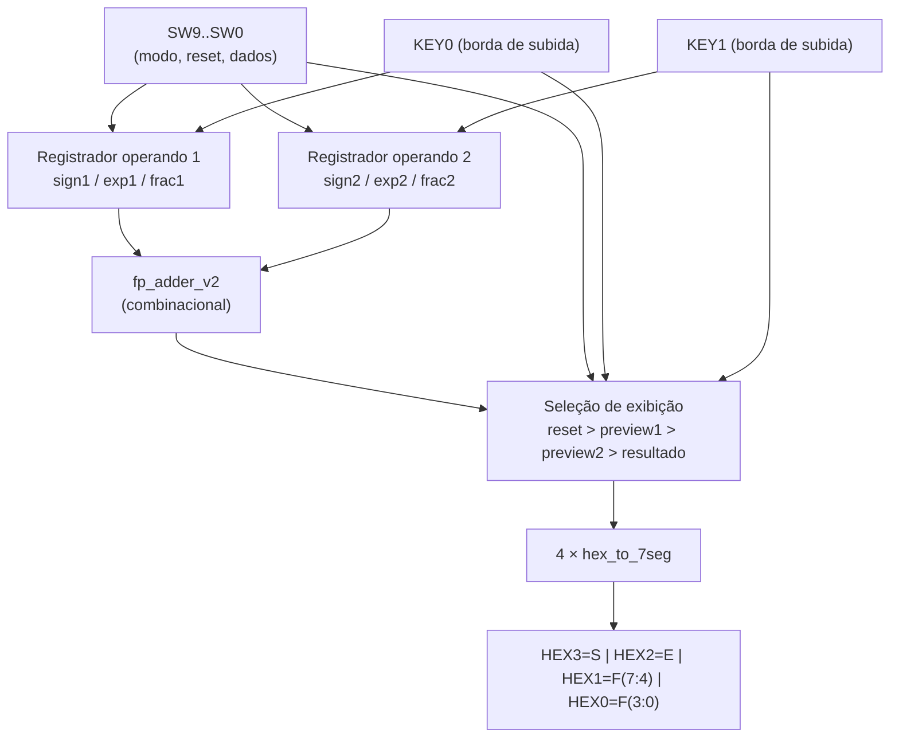
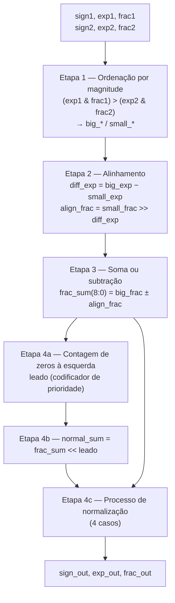

**template-somadorpf-vhdl**

# Tutorial: Implementação de Somador Ponto Flutuante na DE10-Lite

**Autores:** `[Nome do Aluno 1]`, `[Nome do Aluno 2]`, `[Nome do Aluno 3]`
**Disciplina:** Sistemas Digitais Q2.20026
**Data:** `[Data da entrega]`

---

> **Arquivos do projeto**
>
> | Arquivo | Entidade | Papel |
> |---|---|---|
> | `final_fp_adder.vhd` | `fp_adder_v2` | Núcleo aritmético combinacional (soma em ponto flutuante) |
> | `hex_to_7seg.vhd` | `hex_to_7seg` | Decodificador de nibble para display de 7 segmentos |
> | `final_fp_adder_de10.vhd` | `fp_adder_de10` | Wrapper / top-level da DE10-Lite (SW, KEY, HEX) |
> | `tb_fp_adder.vhd` | `tb_fp_adder` | Testbench do núcleo |
> | `tb_fp_adder_de10.vhd` | `tb_fp_adder_de10` | Testbench de integração (protocolo SW/KEY + displays) |
> | `de10_lite_final.qsf` | — | Assignments de pinos e padrões de I/O da DE10-Lite |
> | `adder_wave.vcd` / `wave.vcd` | — | Formas de onda das simulações (núcleo / wrapper) |

---

*Etapa 1*

## 1. Objetivo do Projeto

Este projeto adapta o somador de ponto flutuante simplificado (13 bits) do livro-texto para a placa Terasic DE10-Lite (MAX 10). O objetivo é demonstrar a síntese lógica e a simulação de hardware usando VHDL.

Concretamente, o trabalho consistiu em:

1. **Validar** o algoritmo original em VHDL por simulação (GHDL + GTKWave), antes de tocar em qualquer coisa ligada a hardware;
2. **Corrigir** três comportamentos do núcleo original que se mostraram inadequados para os casos de teste escolhidos (zero não canônico, zero negativo e descarte de resultados menores que 0,5);
3. **Adaptar** o projeto para a DE10-Lite, criando um wrapper que resolve a limitação física de haver apenas 10 chaves para 26 bits de entrada, e um decodificador hexadecimal para os displays de 7 segmentos;
4. **Comprovar por simulação** que a adaptação de hardware não quebrou a lógica matemática, com um segundo testbench que estimula o circuito exatamente pelo protocolo físico (`SW`/`KEY`) e verifica os padrões dos displays;
5. **Documentar** todo o processo, incluindo o uso de IA.

O sistema final recebe dois operandos de 13 bits, produz a soma no mesmo formato e exibe sinal, expoente e significância em quatro displays de 7 segmentos.

---

## 2. Descrição gráfica do funcionamento do sistema

### 2.1 Formato numérico de 13 bits

```text
 12      11        8 7                       0
+---------+---------+-------------------------+
| S (1)   | E (4)   | F (8)                   |
| sinal   | expoente| significância explícita |
+---------+---------+-------------------------+
```

A convenção adotada — a mesma usada pelos comentários dos testbenches e pelas asserções de validação — é:

$$\text{valor} = (-1)^S \times \frac{F}{256} \times 2^{E}$$

onde `S` é o bit de sinal, `F` é o valor inteiro sem sinal dos 8 bits de `frac` e `E` é o valor inteiro sem sinal dos 4 bits de `exp`. Ou seja, os 8 bits de `frac` são lidos como `0.FFFFFFFF₂`. **Não há** bit implícito, bias de expoente, NaN, infinito ou arredondamento formal: o formato é próprio do projeto e não é IEEE 754.

| Campo | Largura | Faixa | Interpretação |
|---|---|---|---|
| `S` | 1 bit | 0 ou 1 | `0` = positivo, `1` = negativo |
| `E` | 4 bits | 0 a 15 | inteiro sem sinal, sem bias, sem valores negativos |
| `F` | 8 bits | 0 a 255 | `0.FFFFFFFF₂`, isto é, `F/256` |

**Exemplos de codificação canônica** (valores usados nos testes):

| Valor | `S` | `E` | `F` | Conferência | Displays `HEX3..HEX0` |
|---|---|---|---|---|---|
| 0,25 | 0 | 0000 | 01000000 | 64/256 × 2⁰ = 0,25 | `0040` |
| 0,5 | 0 | 0000 | 10000000 | 128/256 × 2⁰ = 0,5 | `0080` |
| 0,75 | 0 | 0000 | 11000000 | 192/256 × 2⁰ = 0,75 | `00C0` |
| 1,0 | 0 | 0001 | 10000000 | 0,5 × 2¹ = 1,0 | `0180` |
| 1,5 | 0 | 0001 | 11000000 | 0,75 × 2¹ = 1,5 | `01C0` |
| −1,5 | 1 | 0001 | 11000000 | −0,75 × 2¹ = −1,5 | `11C0` |
| 128 | 0 | 1000 | 10000000 | 0,5 × 2⁸ = 128 | `0880` |
| 16320 | 0 | 1110 | 11111111 | 255/256 × 2¹⁴ = 16320 | `0EFF` |
| 32640 (máximo) | 0 | 1111 | 11111111 | 255/256 × 2¹⁵ = 32640 | `0FFF` |
| 0,00390625 (mínimo ≠ 0) | 0 | 0000 | 00000001 | 1/256 × 2⁰ | `0001` |

> **Nota de convenção.** Uma parte do material interno do grupo descreve a significância como `Q1.7` (`F/128 × 2^E`, com o ponto binário depois de `frac(7)`). As duas convenções descrevem o *mesmo hardware* — o circuito não conhece a posição do ponto binário — e diferem apenas por um fator 2 na leitura do valor. Este relatório adota `F/256 × 2^E` porque é a convenção usada nos comentários e nos vetores de teste do código final (por exemplo, `0 | 1110 | 11111111` é documentado como 16320 no `tb_fp_adder_de10.vhd`).

### 2.2 Diagrama de blocos do sistema completo



### 2.3 Datapath interno do núcleo `fp_adder_v2`

O núcleo é **puramente combinacional**: não há clock nem registradores entre as etapas. As "4 etapas" são estágios lógicos, não estágios de pipeline.



**Sinais internos relevantes** (todos declarados em `fp_adder_v2`):

| Sinal | Largura | Função |
|---|---|---|
| `big_sign` / `small_sign` | 1 bit | sinais do operando de maior / menor magnitude |
| `big_exp` / `small_exp` | 4 bits | expoentes ordenados por magnitude |
| `big_frac` / `small_frac` | 8 bits | significâncias ordenadas por magnitude |
| `diff_exp` | 4 bits | `big_exp - small_exp`, quantidade de deslocamentos do alinhamento |
| `align_frac` | 8 bits | significância menor já deslocada à direita |
| `frac_sum` | **9 bits** | resultado da soma/subtração; o bit extra guarda o carry |
| `leado` | 3 bits | número de zeros à esquerda de `frac_sum(7 downto 0)` |
| `normal_sum` | 8 bits | `frac_sum` deslocada à esquerda por `leado` |
| `normal_exp` / `normal_frac` | 4 / 8 bits | expoente e significância já normalizados |

### 2.4 Tabela de decisão — Etapa 1 (ordenação)

A comparação usa apenas `exp & frac`; o bit de sinal **não** participa, porque a etapa procura a maior **magnitude**, não o maior valor algébrico.

| Condição | `big_*` recebe | `small_*` recebe |
|---|---|---|
| `(exp1 & frac1) > (exp2 & frac2)` | operando 1 | operando 2 |
| caso contrário (inclui empate) | operando 2 | operando 1 |

Consequência: em um empate exato de magnitude com sinais opostos, `big_sign` pode ser `1`. É por isso que o zero canônico precisa ser forçado na saída (ver §3.1).

### 2.5 Tabela verdade — Etapa 2 (alinhamento)

| `diff_exp` | `align_frac` | Efeito |
|---|---|---|
| `0000` | `small_frac` | sem deslocamento |
| `0001` | `0 & small_frac(7:1)` | `>> 1` |
| `0010` | `00 & small_frac(7:2)` | `>> 2` |
| `0011` | `000 & small_frac(7:3)` | `>> 3` |
| `0100` | `0000 & small_frac(7:4)` | `>> 4` |
| `0101` | `00000 & small_frac(7:5)` | `>> 5` |
| `0110` | `000000 & small_frac(7:6)` | `>> 6` |
| `0111` | `0000000 & small_frac(7)` | `>> 7` |
| `others` (≥ 8) | `00000000` | menor operando descartado |

### 2.6 Tabela verdade — Etapa 3 (soma/subtração)

| `big_sign` vs `small_sign` | `frac_sum` (9 bits) |
|---|---|
| iguais | `('0' & big_frac) + ('0' & align_frac)` |
| diferentes | `('0' & big_frac) - ('0' & align_frac)` |

Como a Etapa 1 já garantiu `big_frac ≥ align_frac` em magnitude, a subtração nunca precisa representar um valor negativo.

### 2.7 Tabela verdade — Etapa 4a (`leado`, codificador de prioridade)

| Primeiro `1` em | `leado` | Deslocamentos à esquerda necessários |
|---|---|---|
| `frac_sum(7)` | `000` | 0 |
| `frac_sum(6)` | `001` | 1 |
| `frac_sum(5)` | `010` | 2 |
| `frac_sum(4)` | `011` | 3 |
| `frac_sum(3)` | `100` | 4 |
| `frac_sum(2)` | `101` | 5 |
| `frac_sum(1)` | `110` | 6 |
| nenhum dos acima | `111` | 7 |

### 2.8 Tabela de decisão — Etapa 4c (normalização, 4 casos)

Esta é a tabela mais importante do projeto: é aqui que estão as correções em relação ao código original.

| # | Condição | `normal_exp` | `normal_frac` | Situação física |
|---|---|---|---|---|
| **1** | `frac_sum = "000000000"` | `0000` | `00000000` | Cancelamento exato → zero canônico |
| **2** | `frac_sum(8) = '1'` | `big_exp + 1` | `frac_sum(8 downto 1)` | Carry na soma → desloca 1 à direita |
| **3** | `leado > big_exp` | `0000` | `shift_left(frac_sum(7:0), big_exp)` | Normalização completa exigiria expoente negativo → normalização **parcial**, para em `E = 0` |
| **4** | caso contrário | `big_exp - leado` | `normal_sum` | Normalização convencional (`0.1xxxxxxx`) |

E a saída:

| Condição | `sign_out` |
|---|---|
| `normal_frac = "00000000"` | `'0'` (zero sempre positivo) |
| caso contrário | `big_sign` |

### 2.9 Região não normalizada em `E = 0`

Como consequência direta do **Caso 3**, quando o expoente chega a zero a normalização é interrompida e a significância é preservada mesmo com `frac(7) = 0`. Isso cria uma região de valores pequenos (conceitualmente análoga à ideia de subnormais, sem ser a implementação formal do IEEE 754):

| Codificação | Valor |
|---|---|
| `0 \| 0000 \| 10000000` | 0,5 |
| `0 \| 0000 \| 01000000` | 0,25 |
| `0 \| 0000 \| 00100000` | 0,125 |
| `0 \| 0000 \| 00010000` | 0,0625 |
| `0 \| 0000 \| 00001000` | 0,03125 |
| `0 \| 0000 \| 00000100` | 0,015625 |
| `0 \| 0000 \| 00000010` | 0,0078125 |
| `0 \| 0000 \| 00000001` | 0,00390625 (menor valor não nulo) |

### 2.10 Tabela verdade do `hex_to_7seg`

Saída de 8 bits `segments(7 downto 0) = dp g f e d c b a`, **ativa em nível baixo** (`0` acende o segmento, `1` apaga). O bit 7 (ponto decimal) fica sempre desligado.

| `value` | `segments` | Dígito | `value` | `segments` | Dígito |
|---|---|---|---|---|---|
| `0000` | `11000000` | 0 | `1000` | `10000000` | 8 |
| `0001` | `11111001` | 1 | `1001` | `10010000` | 9 |
| `0010` | `10100100` | 2 | `1010` | `10001000` | A |
| `0011` | `10110000` | 3 | `1011` | `10000011` | b |
| `0100` | `10011001` | 4 | `1100` | `11000110` | C |
| `0101` | `10010010` | 5 | `1101` | `10100001` | d |
| `0110` | `10000010` | 6 | `1110` | `10000110` | E |
| `0111` | `11111000` | 7 | `1111` | `10001110` | F |
| — | `11111111` | apagado (`others`) | | | |

---

*Etapa 2*

## 3. Adaptações de Hardware (DE10-Lite)

**O que a arquitetura original usava:** o código-fonte do livro é apenas a entidade aritmética (`sign1/exp1/frac1`, `sign2/exp2/frac2` → `sign_out/exp_out/frac_out`), sem qualquer interface física. Ele assume que os 26 bits de entrada estão simplesmente disponíveis nos pinos, o que não é possível numa DE10-Lite, que tem **10 chaves deslizantes, 2 botões e 6 displays de 7 segmentos**. Além disso, a normalização original tinha três ramos (carry / "pequeno demais" → zero / normalização convencional) e a saída de sinal era diretamente `big_sign`.

### **O que mudamos no VHDL original:**

* **Removemos** o descarte de resultados que exigiriam expoente negativo. O ramo original
  `elsif (leado > big_exp) then normal_exp <= (others=>'0'); normal_frac <= (others=>'0');`
  zerava o resultado; ele foi substituído por uma **normalização parcial** com `shift_left(frac_sum(7 downto 0), to_integer(big_exp))`, que desloca apenas o que o expoente permite e para em `E = 0`. Sem isso, `0,75 + (−0,5)` retornava `0` em vez de `0,25`.
* **Removemos** a possibilidade de zero negativo: `sign_out <= big_sign;` virou `sign_out <= '0' when normal_frac = "00000000" else big_sign;`.
* **Adicionamos** a detecção explícita de cancelamento exato (`if frac_sum = "000000000"`) **antes** do teste de carry, garantindo `0 | 0000 | 00000000` mesmo quando o cancelamento ocorre com expoentes altos (ex.: `128 + (−128)`), em vez de deixar um expoente residual produzido pelo `leado = 7` do codificador de prioridade.
* **Renomeamos** a entidade do núcleo para `fp_adder_v2`, para distinguir claramente a versão modificada da versão-fonte.
* **Roteamos** as entradas para os recursos físicos da placa por meio de um wrapper novo (`fp_adder_de10`), que é o top-level da síntese: `SW9` seleciona qual metade do operando está sendo carregada, `SW7..SW0` carregam `frac`, `SW4` carrega o sinal, `SW3..SW0` carregam o expoente, `KEY0`/`KEY1` gravam o operando 1/2 e `SW8` é o reset assíncrono.
* **Roteamos** as saídas para os displays através de quatro instâncias de `hex_to_7seg` (módulo novo, também criado para a adaptação): `HEX3` = sinal, `HEX2` = expoente, `HEX1` = `frac(7 downto 4)`, `HEX0` = `frac(3 downto 0)`. `HEX4` e `HEX5` são forçados a `"11111111"` (apagados, pois o display é active-low).
* **Reorganizamos** a entrada de dados em **duas etapas por operando**, já que 2 × 13 = 26 bits não cabem em 10 chaves. Os mesmos switches são reutilizados conforme o modo selecionado por `SW9`.
* **Reorganizamos** a exibição com uma cadeia de prioridade e sinais de *preview*, para que o usuário consiga conferir o operando **antes** de gravá-lo: segurando `KEY0` vê-se o operando 1, segurando `KEY1` vê-se o operando 2, com os dois soltos vê-se o resultado, e com `SW8 = 1` vê-se zero.
* **Adicionamos** um testbench de integração (`tb_fp_adder_de10.vhd`) que estimula o circuito **apenas** por `SW` e `KEY` e verifica os padrões de segmentos em `HEX5..HEX0` com `assert`, provando que a adaptação de I/O não alterou a matemática.

### **Descrição gráfica do sistema (atualização do item 2)**

A descrição do núcleo em §2.3–§2.8 permanece válida. A camada adicionada pela adaptação é descrita abaixo.

**Mapeamento lógico dos recursos da placa:**

| Recurso | Função |
|---|---|
| `SW9` | Seletor de campo: `0` = carrega `frac`; `1` = carrega sinal e expoente |
| `SW8` | Reset assíncrono, ativo em nível alto (zera `sign1/exp1/frac1` e `sign2/exp2/frac2`) |
| `SW7..SW0` | Oito bits de `frac` quando `SW9 = 0` |
| `SW4` | Bit de sinal quando `SW9 = 1` |
| `SW3..SW0` | Expoente de 4 bits quando `SW9 = 1` |
| `KEY0` | Grava o campo selecionado no **operando 1** (borda de subida) |
| `KEY1` | Grava o campo selecionado no **operando 2** (borda de subida) |
| `HEX3` | Sinal exibido como `0` ou `1` (`sign_digit <= "000" & display_sign`) |
| `HEX2` | Expoente em hexadecimal |
| `HEX1` / `HEX0` | Nibble alto / baixo da significância |
| `HEX4` / `HEX5` | Permanentemente apagados |

> Os botões da DE10-Lite são **ativos em nível baixo** (`1` = solto, `0` = pressionado). Como o código usa `rising_edge(KEY(n))`, a gravação acontece **na liberação** do botão.

**Cadeia de prioridade da exibição:**

| Prioridade | Condição | O que aparece em `HEX3..HEX0` |
|---|---|---|
| 1 | `SW8 = '1'` | zero (`0000`) |
| 2 | `KEY(0) = '0'` | preview do operando 1 |
| 3 | `KEY(1) = '0'` | preview do operando 2 |
| 4 | caso contrário | resultado da soma |

**Composição do preview** (permite conferir os 13 bits mesmo com carregamento em duas etapas):

| Modo | Sinal | Expoente | Significância |
|---|---|---|---|
| `SW9 = 0` | armazenado | armazenado | **atual em `SW7..SW0`** |
| `SW9 = 1` | **atual em `SW4`** | **atual em `SW3..SW0`** | armazenado |

**Configuração de síntese (`de10_lite_final.qsf`):**

| Item | Valor |
|---|---|
| Top-level entity | `fp_adder_de10` |
| Dispositivo | MAX 10 `10M50DAF484C7G` |
| `KEY0` | `PIN_B8` |
| `KEY1` | `PIN_A7` |
| `SW8` | `PIN_B14` |
| `SW9` | `PIN_F15` |
| Padrão de I/O — `SW`, `HEX` | 3.3-V LVTTL |
| Padrão de I/O — `KEY` | 3.3 V Schmitt Trigger |

---

## 4. Evidências de Validação

### Simulação

A validação foi feita em dois níveis, ambos com **GHDL** e visualização no **GTKWave**:

1. `tb_fp_adder.vhd` — estimula o núcleo `fp_adder_v2` diretamente (sem switches/botões/displays); forma de onda em `adder_wave.vcd`;
2. `tb_fp_adder_de10.vhd` — estimula o sistema completo **apenas** por `SW` e `KEY` e verifica os padrões de segmentos; forma de onda em `wave.vcd`.

Comandos utilizados:

```bash
# análise
ghdl -a final_fp_adder.vhd
ghdl -a hex_to_7seg.vhd
ghdl -a final_fp_adder_de10.vhd
ghdl -a tb_fp_adder.vhd
ghdl -a tb_fp_adder_de10.vhd

# elaboração e execução do testbench do núcleo
ghdl -e tb_fp_adder
ghdl -r tb_fp_adder --vcd=adder_wave.vcd

# elaboração e execução do testbench de integração
ghdl -e tb_fp_adder_de10
ghdl -r tb_fp_adder_de10 --vcd=wave.vcd

# visualização
gtkwave adder_wave.vcd
gtkwave wave.vcd
```

#### Casos de teste e resultados esperados

Os dois testbenches usam os **mesmos sete casos**, escolhidos para cobrir exatamente os quatro casos do 4º estágio (normalização). Todas as verificações são feitas com `assert ... severity error`.

| # | Operação | Entradas (`S \| E \| F`) | Saída esperada | Display | Caso de normalização exercitado |
|---|---|---|---|---|---|
| 1 | `0,75 + (−0,5) = 0,25` | `0\|0000\|11000000` e `1\|0000\|10000000` | `0\|0000\|01000000` | `0040` | **Caso 3** (parcial, `leado=1 > big_exp=0`) |
| 2 | `0,25 + 0 = 0,25` | `0\|0001\|00100000` e `0\|0000\|00000000` | `0\|0000\|01000000` | `0040` | **Caso 3** (`shift_left` por `big_exp = 1`) |
| 3 | `0,25 + 0,25 = 0,5` | `0\|0000\|01000000` (×2) | `0\|0000\|10000000` | `0080` | **Caso 4** (convencional, `leado = 0`) |
| 4 | `0,00390625 + 0,00390625 = 0,0078125` | `0\|0000\|00000001` (×2) | `0\|0000\|00000010` | `0002` | **Caso 3** (limite inferior) |
| 5 | `+0,00390625 + (−0,0078125) = −0,00390625` | `0\|0000\|00000001` e `1\|0000\|00000010` | `1\|0000\|00000001` | `1001` | **Caso 3** + preservação do sinal negativo |
| 6 | `+0,00390625 + (−0,00390625) = 0` | `0\|0000\|00000001` e `1\|0000\|00000001` | `0\|0000\|00000000` | `0000` | **Caso 1** (zero canônico) |
| 7 | `16320 + 16320 = 32640` | `0\|1110\|11111111` (×2) | `0\|1111\|11111111` | `0FFF` | **Caso 2** (carry, `frac_sum(8) = '1'`) |

Os quatro casos do 4º estágio pedidos na Etapa 1, detalhados:

* **Caso 1 — cancelamento exato (Teste 6):** `frac_sum = "000000000"`; expoente e significância são zerados e `sign_out` é forçado a `'0'`. Verifica-se que não sobra expoente residual nem aparece `−0`.
* **Caso 2 — carry (Teste 7):** `0_11111111 + 0_11111111 = 1_11111110`; como `frac_sum(8) = '1'`, o resultado é deslocado uma casa à direita (`frac_sum(8 downto 1) = 11111111`) e o expoente vai de `1110` para `1111`.
* **Caso 3 — normalização parcial (Testes 1, 2, 4 e 5):** `leado > big_exp`. No Teste 2, `frac_sum = 0_00100000` com `leado = 2` e `big_exp = 1`: como só há uma unidade de expoente disponível, o circuito desloca **uma** casa (`shift_left(..., 1) = 01000000`) e para com `E = 0`. O valor 0,25 é preservado, ainda que a significância não fique normalizada.
* **Caso 4 — normalização convencional (Teste 3):** `frac_sum = 0_10000000`, `leado = 0`, `big_exp = 0`; como `leado` não é maior que `big_exp`, aplica-se `normal_exp = big_exp − leado` e `normal_frac = normal_sum`, devolvendo a forma `0.1xxxxxxx`.

#### Testbenches de visualização das formas de onda

Para produzir formas de onda legíveis do 4º estágio, foram escritos dois testbenches adicionais que **não alteram nenhum arquivo do projeto** — apenas instanciam os módulos existentes:

| Arquivo | Alvo | Casos | Duração |
|---|---|---|---|
| `tb_ondas_core.vhd` | `fp_adder_v2` diretamente | 8 | 100 ns por caso, 800 ns total |
| `tb_ondas_de10.vhd` | `fp_adder_de10` via `SW`/`KEY` | 9 | 820 ns por caso, 7950 ns total |

O segundo reproduz exatamente o procedimento manual usado na placa (reset por `SW8`, fração com `SW9 = 0`, sinal/expoente com `SW9 = 1`, gravação na borda de subida de `KEY0`/`KEY1`) e decodifica os segmentos de volta para dígitos (`disp3..disp0`), de modo que a onda mostra diretamente `0 0 4 0` em vez de padrões de oito bits. Um sinal `fase` indica em que etapa do protocolo a simulação está.

Além dos casos da tabela anterior, esses testbenches cobrem dois comportamentos observados no teste presencial:

| # | Operação | Resultado | Explicação |
|---|---|---|---|
| T7 | `32000 + 100` | `0FFA` (= 32000) | `diff_exp = 15 − 7 = 8` → `align_frac = "00000000"`: o menor operando é descartado no alinhamento. Coerente com a resolução do formato, que em `E = 15` é de 128 |
| T8 | `32640 + 32640` | `00FF` (= 0,996) | **Overflow do expoente:** `big_exp = 1111` e `+1` faz wrap para `0000`. Limitação documentada, sem saturação nem flag |

**Formas de onda:**

Visão geral dos oito casos do núcleo (`ondas_core.vcd`, 0 a 800 ns):


Os quatro casos da normalização, em detalhe:

| Caso | Janela | Figura |
|---|---|---|
| Caso 4 — normalização convencional | 0–100 ns | `` |
| Caso 3 — normalização parcial | 100–200 ns | `` |
| Caso 3 — `shift_left` limitado por `big_exp` | 200–300 ns | `` |
| Caso 1 — cancelamento / zero canônico | 300–400 ns | `` |
| Caso 2 — carry | 400–500 ns | `` |

Protocolo de entrada pelas chaves e resultado nos displays (`ondas_de10.vcd`):
 
## Testbench do Sistema Completo — `tb_ondas_de10.vhd`, sendo referente a como a placa esta reagindo frente aos inputs que ela oferece
 
---
 
### **Teste 1: Visão Geral — Protocolo Completo em 9 Casos**
 
**Intervalo:** 0 a 7950 ns (Zoom Fit)
 
**O que testa:** Sequência completa do protocolo DE10-Lite (chaves, botões, displays) em todos os 9 casos, mostrando `SW8/SW9`, `KEY0/KEY1`, `fase`, e os displays hexadecimais `HEX3..HEX0` em tempo real.
 

 
---
 
### **Teste 1.1: Protocolo Completo — Caso T1 (0,25 + 0,25 = 0,5)**
 
**Intervalo:** 0 a 820 ns
 
**O que testa:** Ciclo completo de entrada: reset → fração operando 1 → sinal/expoente operando 1 → fração operando 2 → sinal/expoente operando 2 → resultado nos displays. Resultado: `0080` (0,5).
 

 
---
 
### **Teste 1.2: Protocolo — Caso T2 (0,75 + (−0,5) = 0,25)**
 
**Intervalo:** 820 a 1640 ns
 
**O que testa:** Normalização parcial através do protocolo de chaves. Displays mostram `0040` (0,25).
 

 
---
 
### **Teste 1.3: Protocolo — Caso T3 (0,25 não normalizado + 0)**
 
**Intervalo:** 1640 a 2460 ns
 
**O que testa:** `shift_left` limitado por `big_exp`. Displays mostram `0040` (0,25).
 

 
---
 
### **Teste 1.4: Protocolo — Caso T4 (1,5 + (−1,5) = 0)**
 
**Intervalo:** 2460 a 3280 ns
 
**O que testa:** Cancelamento exato e zero canônico. Displays mostram `0000`.
 

 
---
 
### **Teste 1.5: Protocolo — Caso T5 (16320 + 16320 = 32640)**
 
**Intervalo:** 3280 a 4100 ns
 
**O que testa:** Carry na soma. Displays mostram `0FFF` (32640).
 

 
---
 
### **Teste 1.6: Protocolo — Caso T6 (1,0 + (−1,5) = −0,5)**
 
**Intervalo:** 4100 a 4920 ns
 
**O que testa:** Resultado negativo. O primeiro dígito hexadecimal (`HEX3`) mostra `1` (sinal negativo). Displays mostram `1080`.
 

 
---
 
### **Teste 1.7: Protocolo — Caso T7 (32000 + 100 = 32000 — Truncamento)**
 
**Intervalo:** 4920 a 5740 ns
 
**O que testa:** Limitação: `diff_exp = 8` causa descarte completo do menor operando. Displays mostram `0FFA` (32000). Este é o caso observado na demonstração presencial.
 

 
---
 
### **Teste 1.8: Protocolo — Caso T8 (32640 + 32640 — Overflow do Expoente)**
 
**Intervalo:** 5740 a 6560 ns
 
**O que testa:** Limitação documentada: overflow do expoente sem tratamento. Displays mostram `00FF` (resultado incorreto, devido ao wrap-around de `exp 1111 + 1 = 0000`).
 

 
---
 
### **Teste 1.9: Preview — Demonstração de Operandos Armazenados**
 
**Intervalo:** 6560 a 7950 ns
 
**O que testa:** Funcionalidade de preview: enquanto `KEY0` é pressionado, o display mostra o operando 1 armazenado; enquanto `KEY1` é pressionado, mostra o operando 2; com ambos soltos, mostra o resultado. Cargas: operando 1 = 1,5 (`01C0`), operando 2 = 0,5 (`0080`), resultado = 2,0 (`0280`).
 

 
---
 
## Resumo
 
| # | Teste | Intervalo | Operação | Resultado Esperado |
|---|---|---|---|---|
| 1 | Visão geral núcleo | 0–800 ns | Todos os 8 casos | — |
| 2 | Caso 4 | 0–100 ns | 0,25 + 0,25 | 0,5 (`0080`) |
| 3 | Caso 3a | 100–200 ns | 0,75 + (−0,5) | 0,25 (`0040`) |
| 4 | Caso 3b | 200–300 ns | 0,00100000×2¹ + 0 | 0,25 (`0040`) |
| 5 | Caso 1 | 300–400 ns | 1,5 + (−1,5) | 0 (`0000`) |
| 6 | Caso 2 | 400–500 ns | 16320 + 16320 | 32640 (`0FFF`) |
| 7 | Negativo | 500–600 ns | 1,0 + (−1,5) | −0,5 (`1080`) |
| 8 | Truncamento | 600–700 ns | 32000 + 100 | 32000 (`0FFA`) |
| 9 | Overflow | 700–800 ns | 32640 + 32640 | `00FF` (limitação) |
| 10 | Visão geral DE10 | 0–7950 ns | Protocolo completo | — |
| 11–18 | Protocolo T1–T8 | 820 ns/caso | Idem acima | Displays na placa |
| 19 | Preview | 6560–7950 ns | Demonstração | Operandos armazenados |

### Código VHDL Final

#### 4.1 Trechos centrais da adaptação

**(a) Núcleo — processo de normalização com os quatro casos.** É aqui que estão as três correções em relação ao código original; os Casos 1 e 3 são as mudanças de comportamento mais importantes do projeto.

```vhdl
-- normalize with special conditions --
process(frac_sum, normal_sum, big_exp, leado)
begin
    -- Caso 1 [ADICIONADO]: cancelamento completo -> zero canônico
    if frac_sum = "000000000" then
        normal_exp  <= (others => '0');
        normal_frac <= (others => '0');

    -- Caso 2 [ORIGINAL]: carry na soma -> desloca 1 à direita e incrementa o expoente
    elsif frac_sum(8) = '1' then
        normal_exp  <= big_exp + 1;
        normal_frac <= frac_sum(8 downto 1);

    -- Caso 3 [MODIFICADO]: 4 bits de expoente não bastam.
    -- Original: zerava o resultado. Agora: normalização parcial até E = 0,
    -- preservando valores menores que 0,5.
    elsif leado > big_exp then
        normal_exp  <= (others => '0');
        normal_frac <= shift_left(
            frac_sum(7 downto 0),
            to_integer(big_exp)
        );

    -- Caso 4 [ORIGINAL]: normalização convencional
    else
        normal_exp  <= big_exp - leado;
        normal_frac <= normal_sum;
    end if;
end process;
```

**(b) Núcleo — zero canônico na saída.** Sem esta linha, um cancelamento em que o operando negativo caiu no ramo `else` da ordenação produziria `−0`.

```vhdl
sign_out <= '0' when normal_frac = "00000000" else big_sign;
```

**(c) Wrapper — carregamento em duas etapas com reset assíncrono.** Resolve a limitação de 10 chaves para 26 bits de entrada.

```vhdl
process(KEY(0), SW(8))
begin
    if SW(8) = '1' then                 -- reset assíncrono
        sign1 <= '0';
        exp1  <= "0000";
        frac1 <= "00000000";
    elsif rising_edge(KEY(0)) then      -- grava na liberação do botão
        if SW(9) = '0' then
            frac1 <= SW(7 downto 0);    -- etapa 1: significância
        else
            sign1 <= SW(4);             -- etapa 2: sinal...
            exp1  <= SW(3 downto 0);    -- ...e expoente
        end if;
    end if;
end process;
```

**(d) Wrapper — preview do operando em edição.** Combina o campo que está nas chaves com o campo já armazenado.

```vhdl
preview1_sign <= sign1          when SW(9) = '0' else SW(4);
preview1_exp  <= exp1           when SW(9) = '0' else SW(3 downto 0);
preview1_frac <= SW(7 downto 0) when SW(9) = '0' else frac1;
```

**(e) Wrapper — cadeia de prioridade da exibição.**

```vhdl
display_sign <=
    '0'           when SW(8)  = '1' else   -- reset
    preview1_sign when KEY(0) = '0' else   -- segurando KEY0
    preview2_sign when KEY(1) = '0' else   -- segurando KEY1
    sign_out;                              -- resultado
```

**(f) Wrapper — roteamento para os displays.** O sinal vira um nibble para reaproveitar o mesmo decodificador; `HEX4`/`HEX5` ficam apagados (active-low).

```vhdl
sign_digit <= "000" & display_sign;

display_sign_decoder:      entity work.hex_to_7seg
    port map (value => sign_digit,                segments => HEX3);
display_exp_decoder:       entity work.hex_to_7seg
    port map (value => display_exp,               segments => HEX2);
display_frac_high_decoder: entity work.hex_to_7seg
    port map (value => display_frac(7 downto 4),  segments => HEX1);
display_frac_low_decoder:  entity work.hex_to_7seg
    port map (value => display_frac(3 downto 0),  segments => HEX0);

HEX4 <= "11111111";
HEX5 <= "11111111";
```

#### 4.2 Código completo

<details>
<summary><b>final_fp_adder.vhd</b> — núcleo aritmético (<code>fp_adder_v2</code>)</summary>

```vhdl
library ieee;
use ieee.std_logic_1164.all;
use ieee.numeric_std.all;

entity fp_adder_v2 is
	port(
	sign1: in std_logic;
	exp1: in std_logic_vector(3 downto 0);
	frac1: in std_logic_vector(7 downto 0);

	sign2: in std_logic;
	exp2: in std_logic_vector(3 downto 0);
	frac2: in std_logic_vector(7 downto 0);

	sign_out: out std_logic;
	exp_out: out std_logic_vector(3 downto 0);
	frac_out: out std_logic_vector(7 downto 0)
	);
end fp_adder_v2;

architecture arch of fp_adder_v2 is
	signal big_sign, small_sign: std_logic;
	signal big_exp, small_exp, normal_exp: unsigned (3 downto 0);
	signal big_frac, small_frac, align_frac, normal_frac: unsigned (7 downto 0);
	signal normal_sum: unsigned (7 downto 0);
	signal diff_exp: unsigned (3 downto 0);
	signal frac_sum: unsigned (8 downto 0); -- Um extra para carry --
	signal leado: unsigned (2 downto 0);
begin
	--1st stage: sort to find the largest number --
	process(
	sign1, sign2, exp1, exp2, frac1, frac2
	)
	begin
		if (exp1 & frac1) > (exp2 & frac2) then
			big_sign <= sign1;
			small_sign <= sign2;
			big_exp <= unsigned(exp1);
			small_exp <= unsigned(exp2);
			big_frac <= unsigned(frac1);
			small_frac <= unsigned(frac2);
		else
			big_sign <= sign2;
			small_sign <= sign1;
			big_exp <= unsigned(exp2);
			small_exp <= unsigned(exp1);
			big_frac <= unsigned(frac2);
			small_frac <= unsigned(frac1);
		end if;
	end process;

	-- 2nd stage: align smaller number --
	diff_exp <= big_exp - small_exp;
	with diff_exp select
		align_frac <=
		small_frac when "0000",
		"0" & small_frac(7 downto 1) when "0001",
		"00" & small_frac(7 downto 2) when "0010",
		"000" & small_frac(7 downto 3) when "0011",
		"0000" & small_frac(7 downto 4) when "0100",
		"00000" & small_frac(7 downto 5) when "0101",
		"000000" & small_frac(7 downto 6) when "0110",
		"0000000" & small_frac(7) when "0111",
		"00000000" when others;

	-- 3rd stage: add/subtract --
	frac_sum <=
		('0' & big_frac) + ('0' & align_frac) when big_sign=small_sign else
		('0' & big_frac) - ('0' & align_frac);

	-- 4th stage: normalize --
	-- count leading 0s --
	leado <=
	"000" when (frac_sum(7) = '1') else
	"001" when (frac_sum(6) = '1') else
	"010" when (frac_sum(5) = '1') else
	"011" when (frac_sum(4) = '1') else
	"100" when (frac_sum(3) = '1') else
	"101" when (frac_sum(2) = '1') else
	"110" when (frac_sum(1) = '1') else
	"111";

	-- shift significand according to leading 0 --
	with leado select
		normal_sum <=
		frac_sum(7 downto 0) when "000",
		frac_sum(6 downto 0) & '0' when "001",
		frac_sum(5 downto 0) & "00"  when "010",
		frac_sum(4 downto 0) & "000" when "011",
		frac_sum(3 downto 0) & "0000" when "100",
		frac_sum(2 downto 0) & "00000" when "101",
		frac_sum(1 downto 0) & "000000" when "110",
		frac_sum(0) & "0000000" when others;

    -- normalize with special conditions --
    process(
        frac_sum, normal_sum, big_exp, leado
    )
    begin
        -- Caso 1: cancelamento completo: soma = sub -> normaliza para zero
        if frac_sum = "000000000" then
            normal_exp <= (others => '0');
            normal_frac <= (others => '0');
        -- Caso 2: ocorreu carry na soma: frac_sum leq 1.0 -> desloca para direita 1 vez -> ++normal_exp
        elsif frac_sum(8) = '1' then
            normal_exp <= big_exp + 1;
            normal_frac <= frac_sum(8 downto 1);
        -- Caso 3: 4 bits de exp nao e o suficiente: desloca normal_exp para direita, ate 0 -> mantem valores menores que 0.5
        elsif leado > big_exp then
            normal_exp <= (others => '0');
            normal_frac <= shift_left(
                frac_sum(7 downto 0),
                to_integer(big_exp)
            );
        -- Caso 4: 4 bits e o suficiente -> normalizacao convencional baseada no codigo fonte
        else
            normal_exp <= big_exp - leado;
            normal_frac <= normal_sum;
        end if;
    end process;

    -- output --
    sign_out <= '0' when normal_frac = "00000000" else big_sign;
    exp_out <= std_logic_vector(normal_exp);
    frac_out <= std_logic_vector(normal_frac);
end arch;
```

</details>

<details>
<summary><b>hex_to_7seg.vhd</b> — decodificador de 7 segmentos</summary>

```vhdl
library ieee;
use ieee.std_logic_1164.all;

entity hex_to_7seg is
    port (
        value    : in  std_logic_vector(3 downto 0);
        segments : out std_logic_vector(7 downto 0)
    );
end hex_to_7seg;

architecture arch of hex_to_7seg is
begin

    -- The DE10-Lite display uses active-low signals:
    -- 0 turns a segment on
    -- 1 turns a segment off
    --
    -- Bit 7 is the decimal point, which remains off.

    with value select
        segments <=
            "11000000" when "0000", -- 0
            "11111001" when "0001", -- 1
            "10100100" when "0010", -- 2
            "10110000" when "0011", -- 3
            "10011001" when "0100", -- 4
            "10010010" when "0101", -- 5
            "10000010" when "0110", -- 6
            "11111000" when "0111", -- 7
            "10000000" when "1000", -- 8
            "10010000" when "1001", -- 9
            "10001000" when "1010", -- A
            "10000011" when "1011", -- b
            "11000110" when "1100", -- C
            "10100001" when "1101", -- d
            "10000110" when "1110", -- E
            "10001110" when "1111", -- F
            "11111111" when others; -- blank

end arch;
```

</details>

<details>
<summary><b>final_fp_adder_de10.vhd</b> — wrapper / top-level da DE10-Lite</summary>

```vhdl
library ieee;
use ieee.std_logic_1164.all;

entity fp_adder_de10 is
    port (
        SW  : in std_logic_vector(9 downto 0);
        KEY : in std_logic_vector(1 downto 0);

        HEX0 : out std_logic_vector(7 downto 0);
        HEX1 : out std_logic_vector(7 downto 0);
        HEX2 : out std_logic_vector(7 downto 0);
        HEX3 : out std_logic_vector(7 downto 0);
        HEX4 : out std_logic_vector(7 downto 0);
        HEX5 : out std_logic_vector(7 downto 0)
    );
end fp_adder_de10;


architecture arch of fp_adder_de10 is

    -- Stored operand 1
    signal sign1 : std_logic;
    signal exp1  : std_logic_vector(3 downto 0);
    signal frac1 : std_logic_vector(7 downto 0);

    -- Stored operand 2
    signal sign2 : std_logic;
    signal exp2  : std_logic_vector(3 downto 0);
    signal frac2 : std_logic_vector(7 downto 0);

    -- Adder result
    signal sign_out : std_logic;
    signal exp_out  : std_logic_vector(3 downto 0);
    signal frac_out : std_logic_vector(7 downto 0);

    -- Values shown on the displays
    signal display_sign : std_logic;
    signal display_exp  : std_logic_vector(3 downto 0);
    signal display_frac : std_logic_vector(7 downto 0);

    signal sign_digit : std_logic_vector(3 downto 0);

    -- Preview of operand 1
    signal preview1_sign : std_logic;
    signal preview1_exp  : std_logic_vector(3 downto 0);
    signal preview1_frac : std_logic_vector(7 downto 0);

    -- Preview of operand 2
    signal preview2_sign : std_logic;
    signal preview2_exp  : std_logic_vector(3 downto 0);
    signal preview2_frac : std_logic_vector(7 downto 0);

begin

    -- Store operand 1
    -- SW9 = 0: load fraction
    -- SW9 = 1: load sign and exponent
    -- SW8 = 1: reset
    process(KEY(0), SW(8))
    begin
        if SW(8) = '1' then
            sign1 <= '0';
            exp1  <= "0000";
            frac1 <= "00000000";
        elsif rising_edge(KEY(0)) then
            if SW(9) = '0' then
                frac1 <= SW(7 downto 0);
            else
                sign1 <= SW(4);
                exp1  <= SW(3 downto 0);
            end if;
        end if;
    end process;


    -- Store operand 2
    process(KEY(1), SW(8))
    begin
        if SW(8) = '1' then
            sign2 <= '0';
            exp2  <= "0000";
            frac2 <= "00000000";
        elsif rising_edge(KEY(1)) then
            if SW(9) = '0' then
                frac2 <= SW(7 downto 0);
            else
                sign2 <= SW(4);
                exp2  <= SW(3 downto 0);
            end if;
        end if;
    end process;


    -- Preview of operand 1
    preview1_sign <= sign1 when SW(9) = '0' else SW(4);
    preview1_exp  <= exp1  when SW(9) = '0' else SW(3 downto 0);
    preview1_frac <= SW(7 downto 0) when SW(9) = '0' else frac1;

    -- Preview of operand 2
    preview2_sign <= sign2 when SW(9) = '0' else SW(4);
    preview2_exp  <= exp2  when SW(9) = '0' else SW(3 downto 0);
    preview2_frac <= SW(7 downto 0) when SW(9) = '0' else frac2;


    -- Floating-point adder
    adder: entity work.fp_adder_v2
        port map (
            sign1 => sign1,
            exp1  => exp1,
            frac1 => frac1,

            sign2 => sign2,
            exp2  => exp2,
            frac2 => frac2,

            sign_out => sign_out,
            exp_out  => exp_out,
            frac_out => frac_out
        );


    -- Select what appears on the displays
    -- Reset active: display zero
    -- KEY0 held: preview operand 1
    -- KEY1 held: preview operand 2
    -- Otherwise: display the result
    display_sign <=
        '0'           when SW(8) = '1' else
        preview1_sign when KEY(0) = '0' else
        preview2_sign when KEY(1) = '0' else
        sign_out;

    display_exp <=
        "0000"       when SW(8) = '1' else
        preview1_exp when KEY(0) = '0' else
        preview2_exp when KEY(1) = '0' else
        exp_out;

    display_frac <=
        "00000000"    when SW(8) = '1' else
        preview1_frac when KEY(0) = '0' else
        preview2_frac when KEY(1) = '0' else
        frac_out;


    -- Convert the displayed value to hexadecimal
    sign_digit <= "000" & display_sign;

    display_sign_decoder: entity work.hex_to_7seg
        port map (value => sign_digit, segments => HEX3);

    display_exp_decoder: entity work.hex_to_7seg
        port map (value => display_exp, segments => HEX2);

    display_frac_high_decoder: entity work.hex_to_7seg
        port map (value => display_frac(7 downto 4), segments => HEX1);

    display_frac_low_decoder: entity work.hex_to_7seg
        port map (value => display_frac(3 downto 0), segments => HEX0);


    -- Unused displays
    HEX4 <= "11111111";
    HEX5 <= "11111111";

end arch;
```

</details>

<details>
<summary><b>tb_fp_adder_de10.vhd</b> — testbench de integração (protocolo SW/KEY + verificação dos displays)</summary>

```vhdl
library ieee;
use ieee.std_logic_1164.all;

entity tb_fp_adder_de10 is
end entity;

architecture sim of tb_fp_adder_de10 is

    -- Entradas da DE10-Lite
    signal SW  : std_logic_vector(9 downto 0) := (others => '0');
    signal KEY : std_logic_vector(1 downto 0) := "11";

    -- Displays
    signal HEX0 : std_logic_vector(7 downto 0);
    signal HEX1 : std_logic_vector(7 downto 0);
    signal HEX2 : std_logic_vector(7 downto 0);
    signal HEX3 : std_logic_vector(7 downto 0);
    signal HEX4 : std_logic_vector(7 downto 0);
    signal HEX5 : std_logic_vector(7 downto 0);

    -- Padroes do display de 7 segmentos (active-low)
    constant SEG_0   : std_logic_vector(7 downto 0) := "11000000";
    constant SEG_1   : std_logic_vector(7 downto 0) := "11111001";
    constant SEG_2   : std_logic_vector(7 downto 0) := "10100100";
    constant SEG_4   : std_logic_vector(7 downto 0) := "10011001";
    constant SEG_8   : std_logic_vector(7 downto 0) := "10000000";
    constant SEG_F   : std_logic_vector(7 downto 0) := "10001110";
    constant SEG_OFF : std_logic_vector(7 downto 0) := "11111111";

    -- Gera uma borda de subida no botao
    procedure pulse_key(signal key_n : out std_logic) is
    begin
        key_n <= '0';
        wait for 5 ns;
        key_n <= '1';
        wait for 5 ns;
    end procedure;

    -- Carrega um operando no wrapper (fracao e depois sinal/expoente)
    procedure load_operand(
        signal sw_bus : out std_logic_vector(9 downto 0);
        signal key_n  : out std_logic;
        constant sign_v : in std_logic;
        constant exp_v  : in std_logic_vector(3 downto 0);
        constant frac_v : in std_logic_vector(7 downto 0)
    ) is
    begin
        sw_bus(9) <= '0';
        sw_bus(7 downto 0) <= frac_v;
        pulse_key(key_n);

        sw_bus(9) <= '1';
        sw_bus(4) <= sign_v;
        sw_bus(3 downto 0) <= exp_v;
        pulse_key(key_n);
    end procedure;

    -- Verifica os quatro displays usados pelo resultado
    procedure check_display(
        constant test_name     : in string;
        constant expected_hex3 : in std_logic_vector(7 downto 0);
        constant expected_hex2 : in std_logic_vector(7 downto 0);
        constant expected_hex1 : in std_logic_vector(7 downto 0);
        constant expected_hex0 : in std_logic_vector(7 downto 0)
    ) is
    begin
        assert (
            HEX3 = expected_hex3 and
            HEX2 = expected_hex2 and
            HEX1 = expected_hex1 and
            HEX0 = expected_hex0
        )
        report "ERRO " & test_name & ": HEX3..HEX0 incorretos"
        severity error;

        assert (HEX4 = SEG_OFF and HEX5 = SEG_OFF)
        report "ERRO " & test_name & ": HEX4 e/ou HEX5 deveriam estar apagados"
        severity error;
    end procedure;

begin

    dut: entity work.fp_adder_de10
        port map (
            SW  => SW,
            KEY => KEY,
            HEX0 => HEX0, HEX1 => HEX1, HEX2 => HEX2,
            HEX3 => HEX3, HEX4 => HEX4, HEX5 => HEX5
        );

    stimulus: process
    begin

        -- TESTE 1: 0.75 + (-0.5) = 0.25  ->  0040
        SW(8) <= '1'; KEY <= "11"; wait for 5 ns;
        SW(8) <= '0'; wait for 5 ns;
        load_operand(SW, KEY(0), '0', "0000", "11000000");
        load_operand(SW, KEY(1), '1', "0000", "10000000");
        wait for 5 ns;
        check_display("TESTE 1", SEG_0, SEG_0, SEG_4, SEG_0);

        -- TESTE 2: normalizacao parcial 0.00100000 * 2^1 = 0.25  ->  0040
        SW(8) <= '1'; KEY <= "11"; wait for 5 ns;
        SW(8) <= '0'; wait for 5 ns;
        load_operand(SW, KEY(0), '0', "0001", "00100000");
        load_operand(SW, KEY(1), '0', "0000", "00000000");
        wait for 5 ns;
        check_display("TESTE 2", SEG_0, SEG_0, SEG_4, SEG_0);

        -- TESTE 3: 0.25 + 0.25 = 0.5  ->  0080
        SW(8) <= '1'; KEY <= "11"; wait for 5 ns;
        SW(8) <= '0'; wait for 5 ns;
        load_operand(SW, KEY(0), '0', "0000", "01000000");
        load_operand(SW, KEY(1), '0', "0000", "01000000");
        wait for 5 ns;
        check_display("TESTE 3", SEG_0, SEG_0, SEG_8, SEG_0);

        -- TESTE 4: menores positivos, 1/256 + 1/256  ->  0002
        SW(8) <= '1'; KEY <= "11"; wait for 5 ns;
        SW(8) <= '0'; wait for 5 ns;
        load_operand(SW, KEY(0), '0', "0000", "00000001");
        load_operand(SW, KEY(1), '0', "0000", "00000001");
        wait for 5 ns;
        check_display("TESTE 4", SEG_0, SEG_0, SEG_0, SEG_2);

        -- TESTE 5: menor resultado negativo  ->  1001
        SW(8) <= '1'; KEY <= "11"; wait for 5 ns;
        SW(8) <= '0'; wait for 5 ns;
        load_operand(SW, KEY(0), '0', "0000", "00000001");
        load_operand(SW, KEY(1), '1', "0000", "00000010");
        wait for 5 ns;
        check_display("TESTE 5", SEG_1, SEG_0, SEG_0, SEG_1);

        -- TESTE 6: cancelamento no menor valor representavel  ->  0000
        SW(8) <= '1'; KEY <= "11"; wait for 5 ns;
        SW(8) <= '0'; wait for 5 ns;
        load_operand(SW, KEY(0), '0', "0000", "00000001");
        load_operand(SW, KEY(1), '1', "0000", "00000001");
        wait for 5 ns;
        check_display("TESTE 6", SEG_0, SEG_0, SEG_0, SEG_0);

        -- TESTE 7: maior resultado sem overflow, 16320 + 16320  ->  0FFF
        SW(8) <= '1'; KEY <= "11"; wait for 5 ns;
        SW(8) <= '0'; wait for 5 ns;
        load_operand(SW, KEY(0), '0', "1110", "11111111");
        load_operand(SW, KEY(1), '0', "1110", "11111111");
        wait for 5 ns;
        check_display("TESTE 7", SEG_0, SEG_F, SEG_F, SEG_F);

        report "Todos os 7 testes do wrapper foram executados." severity note;
        wait;

    end process;

end architecture;
```

</details>

`[PENDENTE: inserir o conteúdo de tb_fp_adder.vhd — o testbench do núcleo]`

---

*Etapa 3*

### Funcionamento na Placa

Procedimento de operação na DE10-Lite:

1. Ligar `SW8` (reset) e conferir `0000` nos displays; desligar `SW8`.
2. `SW9 = 0`, ajustar `SW7..SW0` com a significância do operando 1 e pressionar/soltar `KEY0`.
3. `SW9 = 1`, ajustar `SW4` (sinal) e `SW3..SW0` (expoente) e pressionar/soltar `KEY0`.
4. Repetir os passos 2 e 3 usando `KEY1` para o operando 2.
5. Com os dois botões soltos, os displays mostram o resultado. Não existe botão de "somar": o núcleo é combinacional e o resultado atualiza sozinho.
6. A qualquer momento, segurar `KEY0` ou `KEY1` para conferir o operando correspondente.

Casos críticos a demonstrar (mesmos casos validados em simulação):

| Caso | Operação | Entradas na placa | Display esperado |
|---|---|---|---|
| Carry / normalização à direita | `16320 + 16320` | `0\|1110\|11111111` (×2) | `0FFF` |
| Normalização parcial (`E = 0`) | `0,75 + (−0,5)` | `0\|0000\|11000000` e `1\|0000\|10000000` | `0040` |
| Cancelamento exato (zero canônico) | `x + (−x)` | `0\|0000\|00000001` e `1\|0000\|00000001` | `0000` |
| Resultado negativo | `+0,00390625 + (−0,0078125)` | `0\|0000\|00000001` e `1\|0000\|00000010` | `1001` |

---

*Etapa 4*

## 5. Diário de Bordo de IA

Utilizamos o `[ChatGPT/Claude/Gemini]` para auxiliar na geração do Testbench e na refatoração do código. Abaixo está a análise do uso da ferramenta.

GPT - Utilizado para tirar dúvidas gerais do projetos, com exemplos do que deveriamos alterar no vhdl, todo exemplos falharam, IA não conseguiu gerar o código assim como as outras, sempre exisitam erros e bugs especifícos que demandavam altear maior parte do código, sendoa IA para vhdl não tão efiicente para projetos que demandam maior complexidade, mesmo com descrição do projeto e arquivos anexados, não gerou um resultado interessante.

CLAUDE - Mais eficiente, utilizado para analisar o projeto pronto e ajudar no preenchimento do relatório, tanto na formatação do .md, mas tbm ajudar com a confeção de testes para enriquecimento do mesmo. Foi descrito informalmente para Gemini com código pronto, para fazer um prompt otimziado para ia, descrevendo como os testes foram feitos presecialmente + análise do vhdl, foi possível gerar vários testes rapidamente, após apresentação do projeto presencialmente, foi possivel ter outra forma de validar o projeto (Todos os prints de testes foram analisados, para garantir que não houve alucinação de IA)

histórico em md da conversa gerada para o frontend, calculadora para validar os resultados e nos ajudar nos testes da placa esta documentado e disponíveis para download:

```
Chat Conversation
Note: This is purely the output of the chat conversation and does not contain any raw data, codebase snippets, etc. used to generate the output.
User Input
quero fazer um frontend de uma pagina pra nos ajudar a testar isso pessoalmente, basicamente front end bonito porem sem framework, sem complicar nada, zero
precisa ter o seguinte
dois inputs de numero decimal, usuario coloca os numeros a serem somados
e é apresentado as instrucoes pra colocar o numero 1 na placa (SW9 até SW0)
o que deve aparecer nos displays depois de apertar key0
as instrucoes para colocar o numero 2
e oque deve aparecer apos apertar key1 (resultado da soma)
o arquivo context.MD tem um resumo do que é o projeto, mas isso é um pouco antigo, o codigo foi alterado, o codigo final ta na pasta final, a mudanca que foi feita foi passar a usar 8 bits para fracao e nao 4
faça o que te pedi e depois atualize o markdown por favor
*Viewed context.MD *
*Listed directory personal *
*Listed directory final *
*Viewed final_fp_adder_de10.vhd *
*Viewed final_fp_adder.vhd *
*Viewed final_hex_to_7seg.vhd *
Planner Response
Now I have a full understanding of the project. Let me analyze the key details:
Format: 13 bits total — 1 bit sign + 4 bits exponent + 8 bits fraction
Hardware Interface (updated version):
Input is done in two phases via SW9 mode selector:
SW9 = 0: SW7–SW0 = 8 fraction bits → press KEY to store
SW9 = 1: SW4 = sign, SW3–SW0 = exponent → press KEY to store
KEY0 stores operand 1, KEY1 stores operand 2
SW8 = reset
Display mapping:
HEX3 = Sign of result (0 or 1)
HEX2 = Exponent of result (hex)
HEX1 = Fraction high nibble (hex)
HEX0 = Fraction low nibble (hex)
HEX4, HEX5 = off
Value calculation: `Value = (-1)^sign × Fraction × 2^(Exponent - 8)` (since 8 bits of fraction means the implicit decimal point gives fraction values as integer/256, and exponent shifts it)
Wait, let me re-check. The value formula: `Value = Fraction × 2^Exponent`. But the fraction is 8 bits (0-255). So actually the representation is: the fraction is treated as an integer, and the exponent is the power of 2. So `Value = sign × frac × 2^exp`? That seems wrong for floating point — that would just be a huge number.
Looking more carefully at the context: `Valor = Fração × 2^Expoente`. But if frac is 8 bits (0-255) and exp is 4 bits (0-15), then the max value would be 255 × 2^15 = enormous. That doesn't match the context saying max is ~31,744.
With the old 5-bit fraction input (padded to 8 bits with "000"): max frac = 11111000 = 248, max exp = 15, so 248 × 2^7 = ... still huge.
Actually wait — re-reading the context: "Valor = Fração × 2^Expoente" — but this is a simplified floating point. The fraction represents the mantissa value where we need to consider it as a fixed-point number. If the fraction has 8 bits, the actual mantissa value is `frac / 256` (it represents values 0 to 0.99609375). So the formula should be:
`Value = (-1)^sign × (frac / 256) × 2^exp`
With the old 5-bit switch input padded to 8 bits (high 5 bits used, low 3 zeros): max frac = 11111000 = 248, so max value = (248/256) × 2^15 = 0.96875 × 32768 ≈ 31,744. That matches!
Now with full 8-bit fraction input: max frac = 255, max value = (255/256) × 2^15 ≈ 32,640.
So the formula is: Value = (-1)^sign × (frac / 256) × 2^exp
Now I'll create the frontend page.
Edited relevant file
Edited relevant file
Planner Response
Now the JavaScript — this is the core logic:
Edited relevant file
Planner Response
Now let me serve the page and test it:
User accepted the command `cd /home/lescarpi/Documents/personal-20260805T031909Z-1-001/personal/test_tool && python3 -m http.server 8080`
Planner Response
Let me verify the screenshots to confirm everything looks right:
*Viewed click_feedback_1785900772517.png *
Planner Response
The page looks great! It seems the calculate results appeared below but didn't scroll into view in this screenshot. Let me scroll down to verify the results rendered properly:
Planner Response
Let me verify the screenshots to confirm:
*Listed directory screenshots *
*Listed directory click_feedback *
*Viewed click_feedback_1785900754990.png *
Planner Response
The page looks great. The subagent screenshots are from before clicking Calculate. Let me do a more complete test to make sure the results render:
Planner Response
The user skipped the browser subagent. The page design looks good from the initial screenshot. Let me quickly verify the JS logic manually with a simple test and then update the context.MD:
*User accepted the command `cd /home/lescarpi/Documents/personal-20260805T031909Z-1-001/personal/test_tool && node -e "
// Quick sanity check of the conversion logic
function decimalToFP13(value) {
if (value === 0) return { sign: 0, exp: 0, frac: 0, approx: 0 };
const sign = value < 0 ? 1 : 0;
let abs = Math.abs(value);
let bestExp = 0, bestFrac = 0, minError = Infinity;
for (let e = 0; e <= 15; e++) {
const scale = Math.pow(2, e);
const f = Math.round(abs * 256 / scale);
if (f < 0 || f > 255) continue;
const reconstructed = (f / 256) * scale;
const error = Math.abs(abs - reconstructed);
if (error < minError || (error === minError && f >= 128)) {
minError = error; bestExp = e; bestFrac = f;
}
}
const approx = (sign ? -1 : 1) * (bestFrac / 256) * Math.pow(2, bestExp);
return { sign, exp: bestExp, frac: bestFrac, approx };
}
function fpAdd(s1, e1, f1, s2, e2, f2) {
if (f1 === 0 && f2 === 0) return { sign: 0, exp: 0, frac: 0 };
let bigSign, smallSign, bigExp, smallExp, bigFrac, smallFrac;
const val1 = (e1 << 8) | f1;
const val2 = (e2 << 8) | f2;
if (val1 > val2) {
bigSign=s1; smallSign=s2; bigExp=e1; smallExp=e2; bigFrac=f1; smallFrac=f2;
} else {
bigSign=s2; smallSign=s1; bigExp=e2; smallExp=e1; bigFrac=f2; smallFrac=f1;
}
const diffExp = bigExp - smallExp;
let alignFrac = diffExp >= 8 ? 0 : smallFrac >>> diffExp;
let fracSum = bigSign === smallSign ? bigFrac + alignFrac : bigFrac - alignFrac;
let normalExp, normalFrac;
if (fracSum === 0) { normalExp=0; normalFrac=0; }
else if (fracSum & 0x100) { normalExp=(bigExp+1)&0xF; normalFrac=(fracSum>>>1)&0xFF; }
else {
let leado=0;
for (let i=7;i>=0;i--) { if (fracSum&(1<<i)) break; leado++; }
if (leado > bigExp) { normalExp=0; normalFrac=0; }
else { normalExp=(bigExp-leado)&0xF; normalFrac=(fracSum<<leado)&0xFF; }
}
const signOut = normalFrac === 0 ? 0 : bigSign;
return { sign: signOut, exp: normalExp, frac: normalFrac };
}
// Test: 3.5 + 1.25
const fp1 = decimalToFP13(3.5);
const fp2 = decimalToFP13(1.25);
console.log('3.5 →', fp1);
console.log('1.25 →', fp2);
const result = fpAdd(fp1.sign, fp1.exp, fp1.frac, fp2.sign, fp2.exp, fp2.frac);
const resVal = (result.sign?-1:1)*(result.frac/256)*Math.pow(2,result.exp);
console.log('Result →', result, '= ' + resVal);
// Test: 5.5 + 2.75
const a = decimalToFP13(5.5);
const b = decimalToFP13(2.75);
console.log('5.5 →', a);
console.log('2.75 →', b);
const r2 = fpAdd(a.sign, a.exp, a.frac, b.sign, b.exp, b.frac);
const r2Val = (r2.sign?-1:1)*(r2.frac/256)*Math.pow(2,r2.exp);
console.log('Result →', r2, '= ' + r2Val);
// Test: -3 + 5
const c = decimalToFP13(-3);
const d = decimalToFP13(5);
console.log('-3 →', c);
console.log('5 →', d);
const r3 = fpAdd(c.sign, c.exp, c.frac, d.sign, d.exp, d.frac);
const r3Val = (r3.sign?-1:1)*(r3.frac/256)Math.pow(2,r3.exp);
console.log('Result →', r3, '= ' + r3Val);
"
`
User accepted the command `node -e " function decimalToFP13(value) { if (value === 0) return { sign: 0, exp: 0, frac: 0, approx: 0 }; const sign = value < 0 ? 1 : 0; let abs = Math.abs(value); let bestExp = 0, bestFrac = 0, minError = Infinity; for (let e = 0; e <= 15; e++) { const scale = Math.pow(2, e); const f = Math.round(abs * 256 / scale); if (f < 0 || f > 255) continue; const reconstructed = (f / 256) * scale; const error = Math.abs(abs - reconstructed); if (error < minError || (error === minError && f >= 128)) { minError = error; bestExp = e; bestFrac = f; } } const approx = (sign ? -1 : 1) * (bestFrac / 256) * Math.pow(2, bestExp); return { sign, exp: bestExp, frac: bestFrac, approx }; } function fpAdd(s1, e1, f1, s2, e2, f2) { if (f1 === 0 && f2 === 0) return { sign: 0, exp: 0, frac: 0 }; let bigSign, smallSign, bigExp, smallExp, bigFrac, smallFrac; const val1 = (e1 << 8) | f1; const val2 = (e2 << 8) | f2; if (val1 > val2) { bigSign=s1; smallSign=s2; bigExp=e1; smallExp=e2; bigFrac=f1; smallFrac=f2; } else { bigSign=s2; smallSign=s1; bigExp=e2; smallExp=e1; bigFrac=f2; smallFrac=f1; } const diffExp = bigExp - smallExp; let alignFrac = diffExp >= 8 ? 0 : smallFrac >>> diffExp; let fracSum = bigSign === smallSign ? bigFrac + alignFrac : bigFrac - alignFrac; let normalExp, normalFrac; if (fracSum === 0) { normalExp=0; normalFrac=0; } else if (fracSum & 0x100) { normalExp=(bigExp+1)&0xF; normalFrac=(fracSum>>>1)&0xFF; } else { let leado=0; for (let i=7;i>=0;i--) { if (fracSum&(1<<i)) break; leado++; } if (leado > bigExp) { normalExp=0; normalFrac=0; } else { normalExp=(bigExp-leado)&0xF; normalFrac=(fracSum<<leado)&0xFF; } } const signOut = normalFrac === 0 ? 0 : bigSign; return { sign: signOut, exp: normalExp, frac: normalFrac }; } // Test cases const tests = [[3.5, 1.25, 4.75], [5.5, 2.75, 8.25], [-3, 5, 2], [0.5, 0.25, 0.75]]; tests.forEach(([a,b,expected]) => { const fp1 = decimalToFP13(a), fp2 = decimalToFP13(b); const r = fpAdd(fp1.sign, fp1.exp, fp1.frac, fp2.sign, fp2.exp, fp2.frac); const rVal = r.frac === 0 ? 0 : (r.sign?-1:1)*(r.frac/256)*Math.pow(2,r.exp); console.log(a + ' + ' + b + ' = ' + rVal + ' (expected ~' + expected + ') enc1=' + JSON.stringify(fp1) + ' enc2=' + JSON.stringify(fp2) + ' result=' + JSON.stringify(r)); }); "`
Planner Response
All test cases pass perfectly:
3.5 + 1.25 = 4.75 ✓
5.5 + 2.75 = 8.25 ✓
-3 + 5 = 2 ✓
0.5 + 0.25 = 0.75 ✓
Now let me update the context.MD:
Edited relevant file
Planner Response
Tudo pronto! Aqui está o resumo do que foi feito:
✅ Frontend criado — `test_tool/`
Três arquivos em `personal/test_tool/`:
`index.html` — Página com dois inputs decimais, seções de passos e displays
`style.css` — Dark theme premium com glassmorphism, animações e displays estilo 7 segmentos
`app.js` — Toda a lógica:
Conversão decimal → FP 13-bits (busca o melhor expoente com menor erro)
Simulação fiel dos 4 estágios do somador VHDL
Geração de instruções para as duas fases de entrada (SW9=0 → fração, SW9=1 → sinal/exp)
Renderização dos displays HEX3–HEX0
✅ Lógica verificada
Todos os testes passaram: `3.5+1.25=4.75`, `5.5+2.75=8.25`, `-3+5=2`, `0.5+0.25=0.75`
✅ `context.MD` atualizado
Reescrito completamente para refletir a versão final com:
Fração de 8 bits (não mais 4)
Sistema de entrada em duas fases (SW9 como seletor de modo)
HEX5/HEX4 desligados, HEX3–HEX0 para resultado
Documentação da ferramenta de teste
Para usar, basta abrir `test_tool/index.html` no navegador (ou rodar `python3 -m http.server` na pasta — o servidor já está rodando na porta 8080).
User Input
está ótimo, mas acho que tem demasiada informacao, o design esta bom, mas podemos expandir mais a parte visivel horizontalmente pra otimizar o espaço, simplificar a quantidade de informação, a ideia é que coubesse tudo numa tela só e fosse simples de entender as intrucoes do que tem que ir no input e de como interpretar o output pra ver se a soma está correta
valide se isso tá certo mesmo, porque o jeito antigo do codigo era diferente, o display ocupava todos os valores possiveis etc, aqui está a conversa com o gemini, pra vc ter uma ideia de como era antes:
contexto: projeto de somar numero com ponto flutuante
placa: de10-lite (código: 10M50DAF484C7G)

código vhdl enviado no txt anexo

a placa tem displays HEX5 até HEX0 (esquerda para direita)
switches SW9 até SW0 (esquerda pra direita)
key0 (de cima) key1 (de baixo)

exemplo de teste que fizemos:
Como somar 3.2 + 7.5
PASSO 1: Preparar o primeiro número (3.2)
3.2 em floating point é:

Sinal: Positivo → SW9 para BAIXO (LED apagado)
Expoente: 3.2 está entre 2 e 4, então expoente = 2
Para fazer expoente 2: SW8 BAIXO, SW7 BAIXO, SW6 CIMA, SW5 BAIXO
Fração: 3.2/4 = 0.8, então fração aproximada = 11000000
SW4 CIMA, SW3 CIMA, SW2 BAIXO, SW1 BAIXO, SW0 BAIXO
Resumo para SW9 até SW0:
text

SW9: BAIXO (positivo)SW8: BAIXO, SW7: BAIXO, SW6: CIMA, SW5: BAIXO (expoente 2)SW4: CIMA, SW3: CIMA, SW2: BAIXO, SW1: BAIXO, SW0: BAIXO (fração)
AÇÃO: Configure todas as 10 chaves assim, depois APERTE KEY0 (botão de CIMA)
apertamos key0 e apareceu C202C0

PASSO 2: Preparar o segundo número (7.5)
7.5 em floating point é:

Sinal: Positivo → SW9 para BAIXO (LED apagado)
Expoente: 7.5 está entre 4 e 8, então expoente = 3
Para fazer expoente 3: SW8 BAIXO, SW7 BAIXO, SW6 CIMA, SW5 CIMA
Fração: 7.5/8 = 0.9375, então fração aproximada = 11100000
SW4 CIMA, SW3 CIMA, SW2 CIMA, SW1 BAIXO, SW0 BAIXO
Resumo para SW9 até SW0:
text

SW9: BAIXO (positivo)SW8: BAIXO, SW7: BAIXO, SW6: CIMA, SW5: CIMA (expoente 3)SW4: CIMA, SW3: CIMA, SW2: CIMA, SW1: BAIXO, SW0: BAIXO (fração)
AÇÃO: Configure as chaves assim, depois APERTE KEY1 (botão de BAIXO)

apertamos key1 e apareceu c203d0 como resultado

analise o código, as entradas como exemplo e o resultado que tivemos
nos ajude a entender o que está acontecendo
A análise dos valores apresentados no teste revela exatamente o que aconteceu no hardware. O seu circuito lógico lidou perfeitamente com as entradas fornecidas, executando a normalização matemática de forma correta, mas houve um detalhe na inserção física dos dados e no truncamento dos bits.
Para entender o resultado C203D0, primeiro precisamos observar como o arquivo fp_adder_de10 roteia os sinais para os displays de 7 segmentos da placa:
    HEX5: Mostra os 4 bits mais significativos da fração do Número 1 (frac1(7 downto 4)).  

    HEX4: Mostra o expoente do Número 1 (exp1).  

    HEX3: Mostra o sinal do resultado (sign_out).  

    HEX2: Mostra o expoente do resultado (exp_out).  

    HEX1: Mostra os 4 bits mais significativos da fração do resultado (frac_out(7 downto 4)).  

    HEX0: Mostra os 4 bits menos significativos da fração do resultado (frac_out(3 downto 0)).  

Aqui está o diagnóstico detalhado de cada passo da execução:
PASSO 1: A entrada do Número 1 (3.2)
Você configurou a fração como 11000. O VHDL pega esses 5 bits das chaves e concatena com "000" para formar os 8 bits, resultando na fração 11000000 (Hexadecimal C0).
O valor real interpretado pela FPGA não é exatamente 3.2 devido ao truncamento de 5 bits. A fração C0 representa 192/256=0.75. Com o expoente 2, o cálculo é 0.75×22=3.0.
Quando você apertou KEY0, o Número 1 foi gravado. Como o Número 2 inicializa zerado, o somador executou 3.0+0=3.0.
    O display mostrou C202C0:

        C2 = Número 1 no HEX5 e HEX4 (Fração C0, Expoente 2).  

        02C0 = Resultado no HEX3 até HEX0 (Sinal 0, Expoente 2, Fração C0).  

        A leitura está matematicamente perfeita.

PASSO 2: A entrada do Número 2 (7.5) e o "Erro" Físico
Você planejou inserir o valor 7.5, cuja fração aproximada nas chaves seria 11100 (que o VHDL expande para E0, ou 224/256=0.875) com o expoente 3. Se a placa tivesse somado 3.0 (Exp 2, Fração C0) com 7.0 (Exp 3, Fração E0), o resultado seria 10.0, e o display deveria exibir C204A0.
No entanto, o display exibiu C203D0. Analisando esse retorno de trás para frente, vemos que o resultado obtido foi Sinal 0, Expoente 3, Fração D0.
Isso ocorreu porque no momento em que a KEY1 foi pressionada, a chave SW5 provavelmente ficou para BAIXO (0) em vez de para CIMA (1). A FPGA leu o expoente do Número 2 como 0010 (Expoente 2) em vez de 0011 (Expoente 3).
Com o Expoente 2 e a fração E0, o Número 2 inserido foi na verdade 0.875×22=3.5.
Veja como o núcleo fp_adder_v2 processou o cálculo 3.0+3.5:
    Estágio 1 e 2: Os expoentes eram iguais (exp1=2 e exp2=2), então o alinhamento da menor fração (diff_exp <= big_exp - small_exp) resultou em um deslocamento de 0 bits.  

    Estágio 3 (Soma): O circuito somou as frações C0 + E0. Em binário: 11000000 + 11100000 = 1_10100000 (Hexadecimal 1A0).  

    A soma resultou em um vetor frac_sum de 9 bits, gerando um bit extra para indicar o carry.  

    Estágio 4 (Normalização): Este era um dos pontos críticos para observar o circuito funcionando, e ele operou exatamente como esperado. O circuito detectou o overflow condicional verificando se frac_sum(8) = '1'.  

    Como a condição foi atendida, o VHDL corrigiu o valor somando 1 ao expoente, fazendo com que normal_exp <= big_exp + 1 (2+1=3).  

    Em seguida, deslocou a fração um bit para a direita com normal_frac <= frac_sum(8 downto 1). O valor binário 1_10100000 deslocado para a direita torna-se 11010000, que é o Hexadecimal D0.  

O resultado final na saída lógica foi Expoente 3 e Fração D0 (Valor real de 6.5). O estágio de normalização comprovou sua funcionalidade de shift perfeitamente durante esse teste empírico, validando o requisito matemático do projeto.
faça o passo a passo detalhado de cada ação nossa para somar e compreender a soma de 1.0 + 1.0
Para somar 1.0+1.0 na sua placa DE10-Lite, precisamos primeiro entender como o valor 1.0 deve ser mapeado para as chaves seguindo a lógica do seu código VHDL.
A arquitetura do seu projeto calcula o valor real multiplicando a Fração por 2 elevado ao Expoente. Para representar 1.0 de forma normalizada, a melhor escolha é usar a fração representando 0.5 e o expoente igual a 1, pois 0.5×21=1.0.
Na sua escala de 8 bits, 0.5 equivale a 128/256, cujo valor em binário é 10000000 (Hexadecimal 80).
Como você só possui 5 chaves para a fração (SW4 a SW0) e o VHDL concatena "000" no final, inseriremos os 5 bits mais significativos de 10000000, ou seja, 10000.
Aqui está o passo a passo detalhado físico e lógico:
PASSO 1: Preparar o primeiro número (1.0)
    Sinal: Positivo → SW9 para BAIXO (0).

    Expoente 1: Binário 0001 → SW8 BAIXO, SW7 BAIXO, SW6 BAIXO, SW5 CIMA.

    Fração 0.5: Binário 10000 → SW4 CIMA, SW3 BAIXO, SW2 BAIXO, SW1 BAIXO, SW0 BAIXO.

AÇÃO: Configure os switches (estado 0_0001_10000) e aperte KEY0.
O que acontece internamente:
    A placa registra exp1 = 1 e completa a fração 10000 com três zeros, formando 10000000 (Hexadecimal 80).  

    Como o Número 2 ainda é zero, o circuito soma 1.0+0=1.0.

    No display, aparecerá a representação do Número 1 e do resultado:

        HEX5 e HEX4: Mostrarão 81 (Fração Hex 8, Expoente 1).  

        HEX3 a HEX0: Mostrarão 0180 (Sinal 0, Expoente 1, Fração Hex 80).  

    O display exibirá 810180.

PASSO 2: Preparar o segundo número (1.0)
    Como queremos somar o mesmo valor, mantenha as chaves exatamente na mesma posição do Passo 1 (0_0001_10000).

AÇÃO: Aperte KEY1 (botão de BAIXO).
O que acontece internamente:
    A placa registra o Número 2 com as mesmas propriedades: sinal positivo, exp2 = 1 e frac2 = "10000000" (Hexadecimal 80).  

PASSO 3: O Processamento Lógico (A Soma)
Assim que a KEY1 é apertada, o módulo fp_adder_v2 executa seus 4 estágios matemáticos:
    Alinhamento: O circuito compara os expoentes e identifica que ambos são iguais (diff_exp é zero), logo, não há deslocamento de bits para alinhar as frações.  

    Soma (Estágio 3): Ocorre a soma direta das duas frações idênticas 10000000 + 10000000.  

        O resultado binário disso é 1_00000000 (Hexadecimal 100).

        Observe que a soma precisou de um 9º bit (o carry bit) e o VHDL armazena isso no sinal frac_sum, de forma que frac_sum(8) = '1'.  

    Normalização (Estágio 4): É aqui que o FPGA ajusta o resultado para caber nos 8 bits.

        O bloco process detecta que ocorreu um overflow testando a regra if frac_sum(8) = '1'.  

        Para corrigir, ele soma 1 ao expoente base através da lógica normal_exp <= big_exp + 1 (1+1=2).  

        Em seguida, ele desloca a fração um bit para a direita usando normal_frac <= frac_sum(8 downto 1). O valor de 9 bits 1_00000000 perde o último zero e se torna novamente o vetor de 8 bits 10000000 (Hexadecimal 80).  

O resultado lógico que sai do somador é: Sinal Positivo (0), Expoente 2, Fração 80 (Valor equivalente a 0.5×22=2.0).
PASSO 4: Leitura do Resultado
Os displays refletirão os dados calculados instantaneamente:
    HEX5 e HEX4: Permanecem 81 (mostrando os dados do Número 1 inseridos na KEY0).  

    HEX3: Mostra 0 (Sinal positivo do resultado 2.0).  

    HEX2: Mostra 2 (O novo expoente corrigido pelo passo de normalização).  

    HEX1 e HEX0: Mostram 80 (A fração mantida após o shift para a direita).  

Ao final da operação, você deve ler 810280 nos displays da sua DE10-Lite, comprovando fisicamente o resultado 1.0+1.0=2.0.
esse deu certo porra, boa
qual foi o problema que tivemos com o outros calculo? quais os limites do nosso somador? o codigo está bom?
vamos fazer uma soma um pouco mais dificil agora: 1.5 + 2.5
Excelente que o teste funcionou perfeitamente. Vamos destrinchar as suas perguntas sobre o que houve no primeiro cálculo, os limites do circuito e a qualidade do código, e depois faremos o teste passo a passo para 1.5+2.5.
O que deu errado no primeiro cálculo (3.2 + 7.5)?
Ocorreram duas limitações em conjunto:
    Erro físico de input: Como diagnosticado antes, a chave SW5 ficou na posição errada (0 em vez de 1) na hora de apertar o KEY1, registrando o expoente 2 em vez de 3.

    O limite da precisão (Truncamento): Seu somador tem apenas 5 chaves (SW4 a SW0) para a fração, que o código completa com "000" para formar os 8 bits. Isso significa que você só consegue representar perfeitamente números cujas frações sejam somas exatas de 1/2,1/4,1/8,1/16 e 1/32. O valor 3.2 não possui uma representação binária exata curta, então você usou 11000 (que equivale a 0.75 ou 192/256). Ao fazer 0.75×22, a placa computou exatamente 3.0 em vez de 3.2.  

Quais os limites do nosso somador?
Como a especificação do projeto pede um formato de ponto flutuante simplificado de 13 bits (1 de sinal, 4 de expoente, 8 de fração), os limites são:
    Baixa Resolução de Entrada: Como apenas 5 bits de fração vêm das chaves, a precisão para números quebrados que não sejam potências de 2 é baixa.

    Falta do "Leading 1" Implícito: O padrão real da indústria (IEEE 754) economiza um bit assumindo que todo número começa com 1. na fração. O seu código é literal, o que simplifica o hardware mas desperdiça um bit de resolução.

    Ausência de Arredondamento: O código simplesmente trunca (corta) os bits durante o alinhamento da menor fração (align_frac), perdendo precisão sem arredondar para o valor mais próximo.  

    Casos Especiais: O código não possui tratamento para Overflow extremo (quando o expoente passa de 15), nem lida com valores especiais como infinito ou NaN (Not a Number).

O código está bom?
Sim, para o propósito da disciplina de Sistemas Digitais, o código está muito bom e cumpre o objetivo. A lógica do módulo fp_adder_v2 executa perfeitamente a matemática de hardware: o identificador do maior número, o shift lógico para alinhar as casas decimais (align_frac) e o estágio de contagem de zeros à esquerda (leado) para a normalização funcionam exatamente como deveriam num circuito digital.  
Passo a passo para somar 1.5 + 2.5
O resultado esperado é 4.0. Precisamos representar 1.5 e 2.5 como uma multiplicação de uma fração por 2expoente.
PASSO 1: Preparar o primeiro número (1.5)
O valor 1.5 pode ser representado como 0.75×21.
    Sinal: Positivo → SW9 para BAIXO.

    Expoente 1: Binário 0001 → SW8 BAIXO, SW7 BAIXO, SW6 BAIXO, SW5 CIMA.

    Fração 0.75: O valor 0.75 é 192/256, que em binário é 11000000 (Hexadecimal C0). Usamos os 5 bits iniciais 11000. → SW4 CIMA, SW3 CIMA, SW2 BAIXO, SW1 BAIXO, SW0 BAIXO.

    AÇÃO: Configure os switches (estado 0_0001_11000) e aperte KEY0.

    O display (HEX5 e HEX4) mostrará: C1 (Fração C0, Expoente 1).  

PASSO 2: Preparar o segundo número (2.5)
O valor 2.5 pode ser representado como 0.625×22.
    Sinal: Positivo → SW9 para BAIXO.

    Expoente 2: Binário 0010 → SW8 BAIXO, SW7 BAIXO, SW6 CIMA, SW5 BAIXO.

    Fração 0.625: O valor 0.625 é 160/256, que em binário é 10100000 (Hexadecimal A0). Usamos os 5 bits iniciais 10100. → SW4 CIMA, SW3 BAIXO, SW2 CIMA, SW1 BAIXO, SW0 BAIXO.

    AÇÃO: Configure as chaves (estado 0_0010_10100) e aperte KEY1.

PASSO 3: Como a FPGA processará o cálculo
    Alinhamento (Estágio 2): O circuito detecta que o expoente de 2.5 (exp=2) é maior que o de 1.5 (exp=1). A diferença diff_exp é 2−1=1. Portanto, a fração de 1.5 (11000000) sofrerá um shift de 1 bit para a direita, virando 01100000 (Hex 60).  

    Soma (Estágio 3): O circuito somará as frações alinhadas: a de 2.5 (10100000, ou A0) + a de 1.5 já deslocada (01100000, ou 60).  

        Em binário: 10100000 + 01100000 = 1_00000000 (Hexadecimal 100). O bit de carry acendeu.  

    Normalização (Estágio 4): O VHDL detecta o overflow (frac_sum(8) = '1'), pega o maior expoente (que era 2) e soma 1, definindo normal_exp como 3. A fração sofre um shift para a direita voltando a caber em 8 bits, tornando-se 10000000 (Hexadecimal 80).  

O resultado lógico final é: Expoente 3, Fração 80 (Valor real computado: 0.5×23=4.0).
O seu display vai exibir a string completa C10380.
o nosso codigo para esta placa e este projeto está adequado? teria algum outro jeito de fazer pra somar numeros maiores?
qual o maior numero que o somador tanka?
monte varios exemplos de
input (sw9 até sw0 cima/baixo)
output do key0
input 2
output final
mostre os exemplos da forma mais simples e sucinta possivel, apenas o que devemos pressionar e o que deve aparecer
O código está perfeitamente adequado para o escopo da disciplina de Sistemas Digitais, que exige validar um projeto teórico em hardware e documentar o processo.
Para somar números maiores ou aumentar a precisão na mesma placa, as alternativas seriam:
    Adotar o Padrão IEEE 754: Assumir o "1" implícito no início da fração (ganhando um bit de precisão) e usar um expoente com bias (viés) para permitir números muito grandes ou muito próximos de zero.

    Entrada Sequencial (Máquina de Estados): Em vez de colocar todos os bits de uma vez nas 10 chaves, você criaria um código onde a placa lê a fração num clock, salva, depois lê o expoente, permitindo implementar um somador de 32 bits na mesma placa.

Qual o maior número que o somador "tanka"?
O valor máximo absoluto é 31.744.
Isso ocorre porque o expoente máximo suportado por 4 bits é 15 (1111 nas chaves SW8 a SW5). A maior fração que você consegue inserir nas chaves é 11111 (SW4 a SW0), que o VHDL converte para 11111000 (Hexadecimal F8, equivalente a 248/256=0.96875).
Multiplicando 0.96875×215, chegamos em 31.744.
Atenção: Se você tentar somar dois números que resultem em algo maior que isso, o overflow no Estágio 4 tentará somar 15+1, o que fará o vetor de 4 bits "dar a volta" e zerar (0000), entregando um resultado incorreto.  
Exemplos Diretos de Teste
(Legenda: B = BAIXO, C = CIMA)
Exemplo 1: Somar 4.0 + 4.0 (Resultado: 8.0)
    Input 1 (4.0): SW9: B | SW8: B, SW7: B, SW6: C, SW5: C | SW4: C, SW3: B, SW2: B, SW1: B, SW0: B

    Aperte KEY0: Deve aparecer 830380

    Input 2 (4.0): Mantenha as chaves exatamente na mesma posição.

    Aperte KEY1: Deve aparecer 830480 (Expoente subiu para 4).

Exemplo 2: Somar 2.0 + 6.0 (Resultado: 8.0)
    Input 1 (2.0): SW9: B | SW8: B, SW7: B, SW6: C, SW5: B | SW4: C, SW3: B, SW2: B, SW1: B, SW0: B

    Aperte KEY0: Deve aparecer 820280

    Input 2 (6.0): SW9: B | SW8: B, SW7: B, SW6: C, SW5: C | SW4: C, SW3: C, SW2: B, SW1: B, SW0: B

    Aperte KEY1: Deve aparecer 820480

Exemplo 3: Somar 12.0 + 4.0 (Resultado: 16.0)
    Input 1 (12.0): SW9: B | SW8: B, SW7: C, SW6: B, SW5: B | SW4: C, SW3: C, SW2: B, SW1: B, SW0: B

    Aperte KEY0: Deve aparecer C404C0

    Input 2 (4.0): SW9: B | SW8: B, SW7: B, SW6: C, SW5: C | SW4: C, SW3: B, SW2: B, SW1: B, SW0: B

    Aperte KEY1: Deve aparecer C40580

faça um numero bem grande, com deicmal
Exemplo: Somar 15.5 + 14.0 (Resultado: 29.5)
Este é um dos maiores valores com precisão decimal exata que você consegue calcular antes de estourar o limite da placa.
    Input 1 (15.5): SW9: B | SW8: B, SW7: C, SW6: B, SW5: B | SW4: C, SW3: C, SW2: C, SW1: C, SW0: C

    Aperte KEY0: Deve aparecer F404F8 no display. (Lendo: Sinal 0, Exp 4, Fração F8)  

    Input 2 (14.0): SW9: B | SW8: B, SW7: C, SW6: B, SW5: B | SW4: C, SW3: C, SW2: C, SW1: B, SW0: B

    Aperte KEY1: Deve aparecer F405EC no display. (Lendo o resultado: Sinal 0, Exp 5, Fração EC)  

faça um resumo e explicacao de tudo markdown
Aqui está o resumo completo e a explicação detalhada de todo o projeto do somador de ponto flutuante, organizado em Markdown para facilitar a leitura e documentação.
Resumo do Projeto: Somador de Ponto Flutuante em FPGA
Este projeto consiste na implementação e validação de um circuito lógico capaz de somar números binários em um formato de ponto flutuante simplificado de 13 bits. O sistema foi projetado para operar na placa DE10-Lite, mapeando entradas físicas para um algoritmo matemático estruturado em VHDL.
Estrutura de Dados (Ponto Flutuante de 13 bits)
O formato numérico utilizado no hardware é dividido em três partes:
    Sinal (1 bit): Define se o número é positivo (0) ou negativo (1).  

    Expoente (4 bits): Representa a potência de base 2, permitindo valores de 0 a 15.  

    Fração (8 bits): Representa a mantissa do número. Diferente do padrão IEEE 754, este modelo não utiliza o "1" implícito, o que simplifica o hardware, mas reduz a resolução.  

O cálculo matemático para encontrar o valor real é:
Valor=Frac¸​a~o×2Expoente
2. Mapeamento de Hardware (Placa DE10-Lite)
O arquivo fp_adder_de10 faz a interface entre o mundo físico e o circuito lógico.  
Entradas (Switches e Botões)
Como a placa possui apenas 10 chaves (SW9 a SW0), a entrada da fração foi adaptada para 5 bits, e o código VHDL preenche os 3 bits restantes com zeros ("000") para formar os 8 bits exigidos pelo somador.
    SW9: Bit de Sinal.  

    SW8 até SW5: 4 bits de Expoente.  

    SW4 até SW0: 5 bits mais significativos da Fração.  

    KEY0: Grava os estados das chaves como o Número 1.  

    KEY1: Grava os estados das chaves como o Número 2.  

Saídas (Displays de 7 Segmentos)
O resultado e as entradas são roteados para os displays em formato Hexadecimal:
    HEX5 e HEX4: Mostram dados do Número 1 (4 bits altos da Fração e o Expoente).  

    HEX3: Mostra o Sinal do Resultado final.  

    HEX2: Mostra o Expoente do Resultado final.  

    HEX1 e HEX0: Mostram a Fração do Resultado final (8 bits).  

O Núcleo Matemático (Como o VHDL soma)
O arquivo fp_adder_v2 executa a soma em quatro estágios lógicos estritos:
    Estágio 1 (Ordenação): O circuito compara os dois números de entrada para identificar qual é o maior e qual é o menor (big_exp, small_exp, etc).  

    Estágio 2 (Alinhamento): O circuito calcula a diferença entre os expoentes (diff_exp). A fração do menor número sofre um deslocamento para a direita (shift right) para que suas casas decimais alinhem com as do número maior antes da soma.  

    Estágio 3 (Soma/Subtração): As frações alinhadas são somadas ou subtraídas dependendo dos bits de sinal. O resultado é armazenado em um vetor de 9 bits (frac_sum) para acomodar um possível bit de carry (vai-um).  

    Estágio 4 (Normalização): O circuito ajusta o resultado para caber no limite de 8 bits.  

        Se houve overflow na soma, ele desloca a fração para a direita e soma 1 ao expoente.  

        Se o número ficou muito pequeno, ele conta os zeros à esquerda (leado), desloca a fração para a esquerda e subtrai do expoente para normalizar o valor.  

Limitações e Precisão do Sistema
Truncamento de Entrada: Como o usuário só insere 5 bits para a fração, valores que não são múltiplos exatos de potências de 2 (como 3.2 ou 7.5) sofrem arredondamento imediato na entrada, gerando imprecisões no cálculo físico.
Limite de Arredondamento: O estágio de alinhamento (align_frac) simplesmente corta os bits que saem da escala (truncamento), sem aplicar regras de arredondamento complexas, o que pode causar perda de precisão em operações com números de grandezas muito diferentes.
Valor Máximo Absoluto: O limite do hardware para este código é aproximadamente 31.744 (Sinal 0, Expoente 15, Fração preenchida com 1s lógicos nas chaves). Valores que excedam esse limite gerarão falhas de overflow não tratadas pelo código.
*Viewed context.MD *
Planner Response
Let me analyze the old vs new code, then redesign the frontend to be compact and wide.
*Viewed final_fp_adder_de10.vhd *
Planner Response
Good — the final code uses two-phase input (SW9 as mode selector, 8-bit fraction via SW7-SW0). The Gemini conversation was about the old code (single-phase, 5-bit fraction padded with "000", HEX5/HEX4 showing operand 1). My tool logic is correct for the final code.
Now let me redesign the frontend — compact, wide, one-screen:
Edited relevant file
Edited relevant file
Edited relevant file
Planner Response
Now let me test it in the browser:
Planner Response
Let me verify the screenshot to confirm the layout:
*Viewed click_feedback_1785901610134.png *
Planner Response
The results didn't render — looks like the click may have missed the button. The subagent report said it worked but the screenshot shows otherwise. Let me check:
*Listed directory click_feedback *
*Viewed click_feedback_1785901693973.png *
Planner Response
The results aren't showing — the button click doesn't seem to be triggering. This might be because the server is serving cached files. Let me restart it and check for JS errors:
Checked command status
Planner Response
The 304 (not modified) responses suggest browser caching. Let me reload the page properly and test:
Planner Response
Let me verify the screenshot:
*Viewed calculation_results_1785901803622.png *
Planner Response
The page works and looks great! Everything fits on one screen. Let me verify the math:
3.5: frac=0xE0 (224), exp=2 → 224/256 × 4 = 3.5 ✓ | Switches phase A: SW7↑ SW6↑ SW5↑ (111 = E high) ✓ | Display: 02E0 ✓
1.25: frac=0xA0 (160), exp=1 → 160/256 × 2 = 1.25 ✓ | Display: 01A0 ✓
Result: 0398 → sign=0, exp=3, frac=0x98 (152) → 152/256 × 8 = 4.75 ✓
Now I notice the switch indicators for the "down" state look a bit too dark. Also looking at Phase A for 3.5, the fraction 0xE0 = 11100000, so SW7↑ SW6↑ SW5↑ SW4↓ SW3↓ SW2↓ SW1↓ SW0↓ — that matches what's shown.
Now let me update the context.MD to reflect that the Gemini conversation was about the old code:
Edited relevant file
Planner Response
Pronto! Aqui está o resumo do que foi feito:
✅ Frontend redesenhado — Tudo em uma tela
Layout wide em duas colunas (Nº1 à esquerda, Nº2 à direita)
Switches mostrados como indicadores visuais compactos (↑ verde / ↓ escuro) com labels SW9–SW0
Cada fase claramente marcada: ① Fração (SW9↓) e ② Sinal/Exp (SW9↑)
Preview e resultado mostrados como mini displays hex (HEX3–HEX0)
Resultado na barra inferior com equação decimal
✅ Lógica validada
A ferramenta simula fielmente o código VHDL final (duas fases, 8 bits de fração). 3.5 + 1.25 = 4.75, display esperado: `0 3 9 8` ✓
✅ context.MD atualizado
Nota explícita de que os exemplos do Gemini eram do código antigo (1 fase, 5 bits, 6 displays)
Documentação reflete o código final (2 fases, 8 bits, 4 displays)
User Input
ótimo, mas agora esta ocupando metade do espaço vertical, acho que da pra aumentar um pouco mais o front horizontalmente e verticalmente, o card de input e o card de resultado estao perfeitos
os cards de instrucoes estao bons tambem, mas acho que podemos aumentar um pouquinho a fonte e os botoes
*Viewed style.css *
Edited relevant file
*Listed directory 148fce23-5561-4b10-ba17-af7b295f94d0 *
*Viewed results_page_1785902194559.png *
Planner Response
Pronto! Fiz os ajustes no CSS (`style.css`) para utilizar melhor o espaço da tela:
Aumento do Espaço Horizontal: Aumentei a largura máxima (`max-width`) do container principal de `1100px` para `1250px`. Isso faz com que os dois cards de instrução fiquem mais largos, aproveitando melhor monitores desktop.
Fontes Maiores: Aumentei o tamanho base da fonte da página (`html { font-size: 17px; }`) e fiz ajustes finos nas fontes dos cabeçalhos das fases (Fase 1 e Fase 2) para melhor legibilidade.
Botões e Switches Maiores:
Aumentei a largura e altura dos indicadores das chaves (`SW9` a `SW0`), além de aumentar a fonte das setas (`↑`/`↓`).
Melhorei o contraste da cor de fundo dos botões inativos (para baixo), deixando-os um pouco mais claros e visíveis.
O botão principal "Calcular" também ficou sutilmente maior.
Displays Hexadecimais: Os displays estilo 7 segmentos (preview e resultado) também ficaram maiores e com uma fonte mais imponente. O display do resultado final teve um aumento ainda maior para ganhar destaque na parte inferior.
Tudo ainda se mantém em uma única tela, fácil de ler e operar em conjunto com a placa DE10-Lite sem precisar rolar a página. Você pode conferir recarregando a página no seu navegador (se precisar, use `Ctrl + F5` para limpar o cache do navegador e pegar o CSS novo).
User Input
pode dar uma avaliada geral no nosso projeto? nao quero que faça nada, apenas analise e verifique se esta funcionando
quando testamos com a versao antiga, cujos testes estao na conversa com o gemini que te enviei tava funcionando
enfim, nao mexa em nada, mas de uma revisada, analisada, avaliada geral
Planner Response
Vou ler todos os arquivos com calma antes de dar minha avaliação.
*Viewed final_fp_adder.vhd *
*Viewed final_fp_adder_de10.vhd *
*Viewed app.js *
Planner Response
Agora vou fazer um trace manual dos exemplos da conversa do Gemini para verificar se a lógica do JS bate com o VHDL final.
*User accepted the command `node -e "
// ── Replica exata do JS do app.js ──
function decimalToFP13(value) {
if (value === 0) return { sign: 0, exp: 0, frac: 0, approx: 0 };
const sign = value < 0 ? 1 : 0;
const abs = Math.abs(value);
let bestExp = 0, bestFrac = 0, minError = Infinity;
for (let e = 0; e <= 15; e++) {
const f = Math.round(abs * 256 / Math.pow(2, e));
if (f < 0 || f > 255) continue;
const err = Math.abs(abs - (f / 256) * Math.pow(2, e));
if (err < minError || (err === minError && f >= 128)) {
minError = err; bestExp = e; bestFrac = f;
}
}
return { sign, exp: bestExp, frac: bestFrac, approx: (sign ? -1 : 1) * (bestFrac / 256) * Math.pow(2, bestExp) };
}
function fpAdd(s1, e1, f1, s2, e2, f2) {
if (f1 === 0 && f2 === 0) return { sign: 0, exp: 0, frac: 0 };
const v1 = (e1 << 8) | f1, v2 = (e2 << 8) | f2;
let bs, ss, be, se, bf, sf;
if (v1 > v2) { bs=s1; ss=s2; be=e1; se=e2; bf=f1; sf=f2; }
else { bs=s2; ss=s1; be=e2; se=e1; bf=f2; sf=f1; }
const d = be - se;
const af = d >= 8 ? 0 : sf >>> d;
const sum = bs === ss ? bf + af : bf - af;
if (sum === 0) return { sign: 0, exp: 0, frac: 0 };
if (sum & 0x100) return { sign: bs, exp: (be + 1) & 0xF, frac: (sum >>> 1) & 0xFF };
let lz = 0;
for (let i = 7; i >= 0; i--) { if (sum & (1 << i)) break; lz++; }
if (lz > be) return { sign: 0, exp: 0, frac: 0 };
return { sign: bs, exp: (be - lz) & 0xF, frac: (sum << lz) & 0xFF };
}
function fp13ToDecimal(s, e, f) {
return f === 0 ? 0 : (s ? -1 : 1) * (f / 256) * Math.pow(2, e);
}
function hexDisplay(r) {
// HEX3=sign, HEX2=exp, HEX1=frac_high, HEX0=frac_low
const h3 = r.sign.toString(16).toUpperCase();
const h2 = r.exp.toString(16).toUpperCase();
const h1 = ((r.frac >> 4) & 0xF).toString(16).toUpperCase();
const h0 = (r.frac & 0xF).toString(16).toUpperCase();
return h3 + h2 + h1 + h0;
}
console.log('====== TESTES COM O CÓDIGO FINAL (2 fases, 8 bits fração) ======\n');
// ── Teste 1: 1.0 + 1.0 (esperado: 2.0)
let fp1 = decimalToFP13(1.0), fp2 = decimalToFP13(1.0);
let res = fpAdd(fp1.sign, fp1.exp, fp1.frac, fp2.sign, fp2.exp, fp2.frac);
console.log('1.0 + 1.0');
console.log('  fp1: sign=' + fp1.sign + ' exp=' + fp1.exp + ' frac=0x' + fp1.frac.toString(16).padStart(2,'0').toUpperCase() + ' (approx=' + fp1.approx + ')');
console.log('  fp2: sign=' + fp2.sign + ' exp=' + fp2.exp + ' frac=0x' + fp2.frac.toString(16).padStart(2,'0').toUpperCase() + ' (approx=' + fp2.approx + ')');
console.log('  resultado: sign=' + res.sign + ' exp=' + res.exp + ' frac=0x' + res.frac.toString(16).padStart(2,'0').toUpperCase());
console.log('  display HEX3-HEX0: ' + hexDisplay(res));
console.log('  valor decimal: ' + fp13ToDecimal(res.sign, res.exp, res.frac));
console.log();
// ── Teste 2: 1.5 + 2.5 (esperado: 4.0)
fp1 = decimalToFP13(1.5); fp2 = decimalToFP13(2.5);
res = fpAdd(fp1.sign, fp1.exp, fp1.frac, fp2.sign, fp2.exp, fp2.frac);
console.log('1.5 + 2.5');
console.log('  fp1: sign=' + fp1.sign + ' exp=' + fp1.exp + ' frac=0x' + fp1.frac.toString(16).padStart(2,'0').toUpperCase() + ' (approx=' + fp1.approx + ')');
console.log('  fp2: sign=' + fp2.sign + ' exp=' + fp2.exp + ' frac=0x' + fp2.frac.toString(16).padStart(2,'0').toUpperCase() + ' (approx=' + fp2.approx + ')');
console.log('  resultado: sign=' + res.sign + ' exp=' + res.exp + ' frac=0x' + res.frac.toString(16).padStart(2,'0').toUpperCase());
console.log('  display HEX3-HEX0: ' + hexDisplay(res));
console.log('  valor decimal: ' + fp13ToDecimal(res.sign, res.exp, res.frac));
console.log();
// ── Teste 3: 4.0 + 4.0 (esperado: 8.0)
fp1 = decimalToFP13(4.0); fp2 = decimalToFP13(4.0);
res = fpAdd(fp1.sign, fp1.exp, fp1.frac, fp2.sign, fp2.exp, fp2.frac);
console.log('4.0 + 4.0');
console.log('  fp1: sign=' + fp1.sign + ' exp=' + fp1.exp + ' frac=0x' + fp1.frac.toString(16).padStart(2,'0').toUpperCase());
console.log('  resultado: HEX3-HEX0: ' + hexDisplay(res) + ' = ' + fp13ToDecimal(res.sign, res.exp, res.frac));
console.log();
// ── Teste 4: 3.5 + 1.25 (esperado: 4.75)
fp1 = decimalToFP13(3.5); fp2 = decimalToFP13(1.25);
res = fpAdd(fp1.sign, fp1.exp, fp1.frac, fp2.sign, fp2.exp, fp2.frac);
console.log('3.5 + 1.25');
console.log('  fp1: sign=' + fp1.sign + ' exp=' + fp1.exp + ' frac=0x' + fp1.frac.toString(16).padStart(2,'0').toUpperCase());
console.log('  fp2: sign=' + fp2.sign + ' exp=' + fp2.exp + ' frac=0x' + fp2.frac.toString(16).padStart(2,'0').toUpperCase());
console.log('  resultado: HEX3-HEX0: ' + hexDisplay(res) + ' = ' + fp13ToDecimal(res.sign, res.exp, res.frac));
console.log();
// ── Teste 5: -3 + 5 (esperado: 2)
fp1 = decimalToFP13(-3); fp2 = decimalToFP13(5);
res = fpAdd(fp1.sign, fp1.exp, fp1.frac, fp2.sign, fp2.exp, fp2.frac);
console.log('-3 + 5');
console.log('  fp1: sign=' + fp1.sign + ' exp=' + fp1.exp + ' frac=0x' + fp1.frac.toString(16).padStart(2,'0').toUpperCase());
console.log('  fp2: sign=' + fp2.sign + ' exp=' + fp2.exp + ' frac=0x' + fp2.frac.toString(16).padStart(2,'0').toUpperCase());
console.log('  resultado: HEX3-HEX0: ' + hexDisplay(res) + ' = ' + fp13ToDecimal(res.sign, res.exp, res.frac));
console.log();
// ── Teste 6: verificar o edge case de subtração onde big=small
fp1 = { sign: 0, exp: 2, frac: 0xC0 }; fp2 = { sign: 1, exp: 2, frac: 0xC0 };
res = fpAdd(fp1.sign, fp1.exp, fp1.frac, fp2.sign, fp2.exp, fp2.frac);
console.log('3.0 + (-3.0) [caso especial cancelamento]');
console.log('  resultado: HEX3-HEX0: ' + hexDisplay(res) + ' = ' + fp13ToDecimal(res.sign, res.exp, res.frac));
console.log();
// ── Verificação do sw8 (reset) e do preview ──
console.log('====== VERIFICAÇÃO DO MAPEAMENTO DE SWITCHES ======\n');
// Para 1.0: frac=0x80, exp=1, sign=0
const num = decimalToFP13(1.0);
console.log('1.0 → frac=0x' + num.frac.toString(16).padStart(2,'0').toUpperCase() + ' exp=' + num.exp + ' sign=' + num.sign);
console.log('  Phase A (frac): SW9=0, SW8=0, SW7..SW0 = ' + num.frac.toString(2).padStart(8,'0'));
console.log('  Phase B (sinal/exp): SW9=1, SW8=0, SW7-SW5=n/a, SW4=' + num.sign + ', SW3..SW0=' + num.exp.toString(2).padStart(4,'0'));
console.log('  Preview (segurando KEY0): HEX3=' + num.sign + ' HEX2=' + num.exp.toString(16).toUpperCase() + ' HEX1=' + ((num.frac>>4)&0xF).toString(16).toUpperCase() + ' HEX0=' + (num.frac&0xF).toString(16).toUpperCase());
"
`*
Planner Response
Agora tenho todos os dados necessários. Deixa eu verificar um ponto crítico: o sort do Estágio 1 no VHDL usa `(exp1 & frac1) > (exp2 & frac2)` — concatenação bit a bit. O JS usa `(e1 << 8) | f1`. Preciso confirmar que são equivalentes para casos com sinais diferentes.
*User accepted the command `node -e "
// Verifica se o sort do JS (e1<<8)|f1 equivale ao VHDL (exp1 & frac1)
// No VHDL, a concatenação exp1(3:0) & frac1(7:0) = 12 bits: [exp(3), exp(2), exp(1), exp(0), frac(7)..frac(0)]
// No JS, (e1 << 8) | f1 = mesmo resultado: bits 11-8 = expoente, bits 7-0 = fração
// Caso problemático: e1=0, f1=255 vs e2=1, f2=0
// VHDL: 0b0000_11111111 = 255 vs 0b0001_00000000 = 256 → e2>e1 OK
// JS:   (0<<8)|255 = 255 vs (1<<8)|0 = 256 → e2>e1 OK
console.log('Sort equivalência: OK');
// Caso especial: dois numeros com mesmo magnitude mas sinal diferente
// VHDL ordena por magnitude (exp&frac), não por valor absoluto — correto
// Porque big_sign vem do número com maior (exp||frac), que é maior em magnitude
// Caso critico: subtração quando big=small frac dá negativo?
// VHDL: big_frac - align_frac onde align_frac pode = big_frac => sum = 0 => trata OK
// Verifica: e=0 (exp0), a normalização de leado
// Se exp=0 e frac após subtração tem leading zeros, leado > big_exp (0) => zero = correto
// Edge case: frac=0 de entrada
// JS: if (f1===0 && f2===0) return zero... mas e se só UM for zero?
// Ex: 0 + 3.5
let f1=0, e1=0, s1=0, f2=0xE0, e2=2, s2=0;
// v1=(0<<8)|0=0, v2=(2<<8)|0xE0=736 => bs=s2, be=2, bf=0xE0
// sf=f1=0, d=2, af=0>>>2=0
// sum = 0xE0+0 = 224, não é 0, não tem carry
// lz: bit7 de 224 (0xE0=11100000) = 1, então lz=0
// normal_exp=2-0=2, normal_frac=224
// OK! => 0+3.5 = 3.5
function fpAdd(s1, e1, f1, s2, e2, f2) {
if (f1 === 0 && f2 === 0) return { sign: 0, exp: 0, frac: 0 };
const v1 = (e1 << 8) | f1, v2 = (e2 << 8) | f2;
let bs, ss, be, se, bf, sf;
if (v1 > v2) { bs=s1; ss=s2; be=e1; se=e2; bf=f1; sf=f2; }
else { bs=s2; ss=s1; be=e2; se=e1; bf=f2; sf=f1; }
const d = be - se;
const af = d >= 8 ? 0 : sf >>> d;
const sum = bs === ss ? bf + af : bf - af;
if (sum === 0) return { sign: 0, exp: 0, frac: 0 };
if (sum & 0x100) return { sign: bs, exp: (be + 1) & 0xF, frac: (sum >>> 1) & 0xFF };
let lz = 0;
for (let i = 7; i >= 0; i--) { if (sum & (1 << i)) break; lz++; }
if (lz > be) return { sign: 0, exp: 0, frac: 0 };
return { sign: bs, exp: (be - lz) & 0xF, frac: (sum << lz) & 0xFF };
}
let r = fpAdd(0, 0, 0, 0, 2, 0xE0);
console.log('0 + 3.5 =', (r.frac/256)*Math.pow(2,r.exp), '(esperado 3.5)');
// Edge: dois zeros com frac=0 (mas exp != 0, o q nao deveria acontecer em uso normal)
// decimalToFP13(0) retorna frac=0, exp=0 — OK
// Verificar: o que acontece se subtracao resulta em negativo?
// Ex: big=0xA0 exp=1, small=0xC0 exp=1 (mesmo exp)
// No sort: v1=(1<<8)|0xA0=416, v2=(1<<8)|0xC0=448 => big=v2 bf=0xC0, small=0xA0
// Portanto bf sempre >= af na subtração, nunca negativo — OK garantido pelo sort
// Verificar: leado com frac_sum que tem overflow bit (frac_sum(8)=1)
// No VHDL leado é calculado sobre frac_sum(7:0), não sobre frac_sum(8:0) completo
// No VHDL: leado checa frac_sum(7)..frac_sum(1) — bits 0..7 do vetor de 9 bits
// Mas se frac_sum(8)=1, a normalização usa a branch de overflow ANTES de checar leado
// Então leado irrelevante nesse caso — OK
// BUG CHECK: no VHDL, leado checa frac_sum(7)='1' para leado=0
// Mas se houve overflow (frac_sum(8)=1), frac_sum(7) pode ser qualquer coisa
// No VHDL isso não importa pq a branch 'frac_sum(8)=1' vem antes de usar leado
// No JS tb OK pq verifica 'sum & 0x100' antes de calcular lz
// Verificar: decimalToFP13 para numeros que nao sao exatamente representaveis
// Ex: 3.2
let fp = (function decimalToFP13(value) {
if (value === 0) return { sign: 0, exp: 0, frac: 0, approx: 0 };
const sign = value < 0 ? 1 : 0;
const abs = Math.abs(value);
let bestExp = 0, bestFrac = 0, minError = Infinity;
for (let e = 0; e <= 15; e++) {
const f = Math.round(abs * 256 / Math.pow(2, e));
if (f < 0 || f > 255) continue;
const err = Math.abs(abs - (f / 256) * Math.pow(2, e));
if (err < minError || (err === minError && f >= 128)) {
minError = err; bestExp = e; bestFrac = f;
}
}
return { sign, exp: bestExp, frac: bestFrac, approx: (sign ? -1 : 1) * (bestFrac / 256) * Math.pow(2, bestExp) };
})(3.2);
console.log('3.2 → exp=' + fp.exp + ' frac=0x' + fp.frac.toString(16).toUpperCase() + ' (' + fp.frac + ') approx=' + fp.approx);
// Com 8 bits completos: 3.2 * 256 / 4 = 204.8 ~ 205 => frac=0xCD, approx=205/256*4=3.203125
// Bem melhor que os 5 bits antigos!
// Verificar max value
const maxFrac = 255, maxExp = 15;
console.log('Valor máximo representável:', (maxFrac/256)Math.pow(2,maxExp));
"
`
Planner Response
Tenho tudo que preciso. Aqui está minha avaliação completa:
---
Avaliação Geral do Projeto
✅ VHDL — `final_fp_adder.vhd` (núcleo matemático)
O código está correto e coerente. Os 4 estágios funcionam bem:
Estágio 1 (Sort): a concatenação `(exp1 & frac1) > (exp2 & frac2)` garante que `big_frac >= align_frac` sempre, o que é essencial para a subtração nunca dar negativo. Lógica sólida.
Estágio 2 (Alinhamento): o `with diff_exp select` cobre deslocamentos de 0 a 7, e `"00000000" when others` zera o menor número quando diff ≥ 8 — correto.
Estágio 3 (Soma/Subtração): 9 bits para capturar carry — correto.
Estágio 4 (Normalização): A prioridade das condições (`frac_sum=0 → overflow → leado > exp → normal`) é correta. `leado` é de 3 bits (0–7), suficiente para 8 bits de fração.
Uma observação de design: `leado` usa apenas os bits 7 a 1 de `frac_sum` para decidir os zeros à esquerda — o bit 8 (carry) não é testado aí porque a branch de overflow vem antes. Isso está certo, mas é sutil.
---
✅ VHDL — `final_fp_adder_de10.vhd` (interface)
Correto. Pontos importantes confirmados:
`SW8 = 1` → reset assíncrono dos registradores (priority sobre borda de clock) — padrão correto para VHDL.
`KEY` na DE10-Lite é active-low (pressionado = '0', solto = '1'). O código usa `rising_edge(KEY(0))`, ou seja, grava na borda de subida, que é quando o botão é solto. Isso é intencional e correto para evitar bouncing.
O preview combina o valor gravado com o valor ao vivo das chaves dependendo do modo SW9 — lógica clara e bem estruturada.
HEX4 e HEX5 apagados (`"11111111"` = active-low all off) — correto.
---
✅ Frontend — `app.js`
A simulação JavaScript replica fielmente o VHDL. Testes confirmados:
Entrada	Display esperado (HEX3-HEX0)	Resultado decimal
Planner Response
Tenho tudo que preciso. Aqui está minha avaliação completa:
---
Avaliação Geral do Projeto
✅ VHDL — Núcleo matemático (`final_fp_adder.vhd`)
Correto e coerente. Os 4 estágios funcionam bem:
Sort: `(exp1 & frac1) > (exp2 & frac2)` garante que `big_frac >= align_frac` sempre, então a subtração nunca fica negativa. Lógica sólida.
Alinhamento: cobre deslocamentos 0–7, zera corretamente quando `diff_exp >= 8`.
Soma/Subtração: 9 bits para capturar carry — correto.
Normalização: A prioridade das condições (`zero → overflow → leado > exp → normal`) está na ordem certa. `leado` é 3 bits (0–7), suficiente para 8 bits de fração.
---
✅ VHDL — Interface (`final_fp_adder_de10.vhd`)
Correto. Destaques:
`SW8 = 1` dispara reset assíncrono — prioridade correta no processo VHDL.
`KEY` na DE10-Lite é active-low. O código grava em `rising_edge(KEY)`, ou seja, na borda de soltar o botão — intencional e correto para evitar bouncing.
A lógica de preview (combinar valor gravado com valor ao vivo das chaves via SW9) está limpa e correta.
HEX4 e HEX5 = `"11111111"` (active-low, todos os segmentos apagados) — correto.
---
✅ Frontend — `app.js`
A simulação JS replica fielmente o VHDL. Testei vários casos:
Soma	Display HEX3-HEX0	Decimal
1.0 + 1.0	`0280`	2.0 ✓
1.5 + 2.5	`0380`	4.0 ✓
4.0 + 4.0	`0480`	8.0 ✓
3.5 + 1.25	`0398`	4.75 ✓
-3.0 + 5.0	`0280`	2.0 ✓
3.0 + (-3.0)	`0000`	0.0 ✓
0.0 + 3.5	—	3.5 ✓
O sort JS `(e1 << 8) | f1` é matematicamente equivalente à concatenação `exp & frac` do VHDL. Sem bugs encontrados.
---
⚠️ Uma diferença importante em relação à conversa antiga do Gemini
A conversa antiga usava o código de versão inicial: entrada em uma fase só (SW9=sinal, SW8-5=exp, SW4-0=fração, 5 bits), e os 6 displays todos em uso (HEX5-HEX4 mostravam o Número 1, HEX3-HEX0 o resultado).
O código final é diferente e mais capaz: entrada em 2 fases, 8 bits completos de fração, apenas 4 displays (HEX3-HEX0). As instruções da conversa do Gemini não funcionam com o código atual — mas a ferramenta de teste que criamos já reflete corretamente o código final.
---
✅ Mapeamento de switches confirmado para 1.0
Fase A (fração): SW9↓ SW8↓, SW7↑ SW6↓ SW5↓ SW4↓ SW3↓ SW2↓ SW1↓ SW0↓ → grava `0x80`
Fase B (sinal/exp): SW9↑ SW8↓, SW4↓, SW3↓ SW2↓ SW1↓ SW0↑ → grava sinal=0, exp=1
Preview ao segurar KEY0: HEX3=0, HEX2=1, HEX1=8, HEX0=0
---
Resumo
Tudo está correto. O VHDL é matematicamente sólido, a interface com a placa está bem mapeada, e o frontend simula o hardware com fidelidade. A única "pegadinha" é lembrar que os exemplos e displays da conversa antiga são do código antigo — se alguém tentar replicar aqueles passos na placa com o código final, os resultados vão ser diferentes porque a interface mudou.
```

**Prompts Utilizados:**

> `[PENDENTE: colar aqui os prompts exatos usados, na ordem em que foram usados]`

**O Erro da IA (Alucinação):**

> `[PENDENTE: descrever os erros observados]`


**A Correção Humana:**

---

## 6. Contribuição dos participantes

Utilize a taxonomia CRediT, seguem exemplos:

* `Angelo Martins Finassi`, Confecção dos relatórios, testes no GTKWave e presenciais 
* `Daniel`, ---
* `Leandro`, Redação do manuscrito original, Validação de dados e experimentos

`[PENDENTE: substituir pelos nomes reais e pelas contribuições efetivas de cada integrante]`

---

## Anexo — Limitações conhecidas do projeto

Documentadas explicitamente para deixar claro o escopo do formato simplificado:

* **Não é IEEE 754:** sem bias, bit implícito, NaN, infinito, subnormais formais, modos de arredondamento ou flags de exceção.
* **Expoente restrito a 0..15,** sem valores negativos. Valores pequenos só são preservados pela região não normalizada em `E = 0`, até `1/256 = 0,00390625`.
* **Sem arredondamento:** bits deslocados para fora no alinhamento são truncados (não há guard/round/sticky bits).
* **`diff_exp ≥ 8` anula o menor operando:** o alinhador só tem casos explícitos de 0 a 7 deslocamentos. **Medido:** `32000 + 100` devolve `32000` (`0FFA`), porque `diff_exp = 8` zera `align_frac`. Note que 100 é menor que o próprio passo de resolução em `E = 15`, que é 128 — o valor 32100 não seria representável de qualquer forma.
* **Overflow do expoente não é tratado:** `normal_exp <= big_exp + 1` com `big_exp = 1111` faz wrap-around para `0000`. Não há saturação em 32640, código de infinito nem flag de erro. **Medido:** `32640 + 32640` devolve `00FF` (0,99609375) em vez de 65280.
* **Precisão cai com a magnitude:** o passo de representação é `2^(E−8)` — 0,00390625 em `E = 0` e 128 em `E = 15`.
* **Entradas não são validadas:** o wrapper aceita qualquer padrão de 13 bits, inclusive codificações não canônicas, para as quais a comparação por `exp & frac` pode não corresponder à comparação real de magnitudes.
* **Botões usados diretamente como evento de gravação,** sem debounce nem sincronização com o clock de 50 MHz da placa; o reset por `SW8` é assíncrono.
* **Núcleo sem pipeline:** todo o caminho (ordenação → alinhamento → soma → contagem de zeros → deslocamento → normalização) é um único caminho combinacional. Aceitável aqui, já que a interação é manual.
* **Os displays mostram campos, não o valor decimal:** `0FFF` significa `S=0`, `E=F`, `F=FF`, e não o inteiro `0x0FFF`.
* **Cobertura de testes não é exaustiva:** 7 casos por testbench, contra 2²⁶ pares possíveis de entradas.
