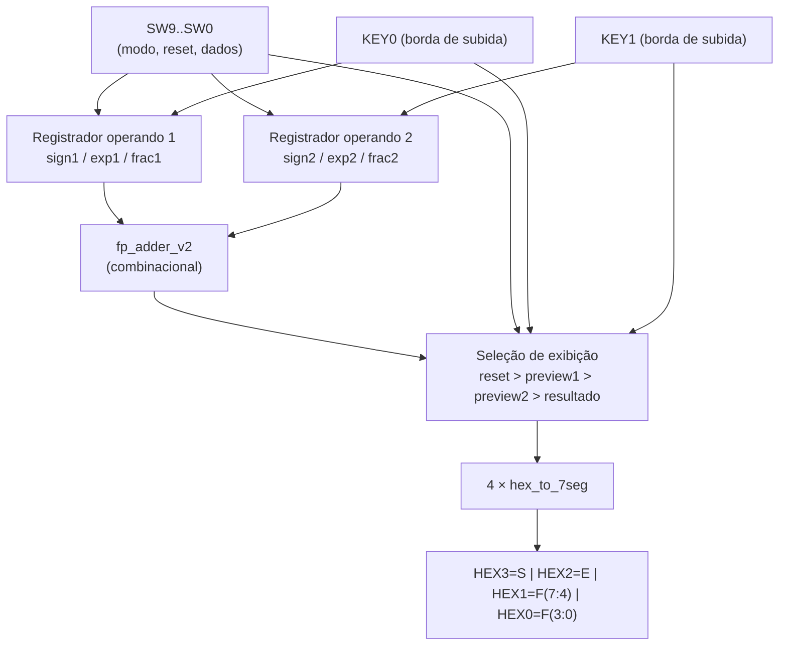
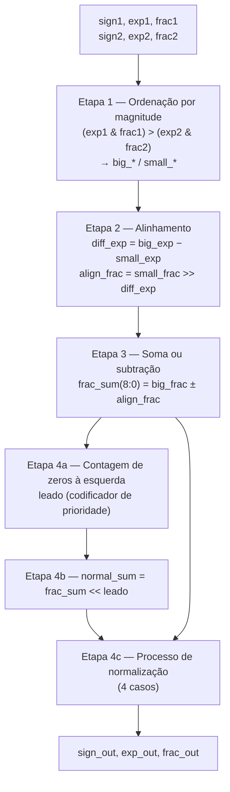

**template-somadorpf-vhdl**

# Tutorial: Implementação de Somador Ponto Flutuante na DE10-Lite

**Autores:** `Angelo Martins Finassi`, `Daniel`, `Leandro`
**Disciplina:** Sistemas Digitais Q2.20026
**Data:** `09/08/2026`

---

> **Arquivos do projeto**
>
> | Arquivo | Entidade | Papel |
> |---|---|---|
> | `final_fp_adder.vhd` | `fp_adder_v2` | Núcleo aritmético combinacional (soma em ponto flutuante) |
> | `hex_to_7seg.vhd` | `hex_to_7seg` | Decodificador de nibble para display de 7 segmentos |
> | `final_fp_adder_de10.vhd` | `fp_adder_de10` | Wrapper / top-level da DE10-Lite (SW, KEY, HEX) |
> | `tb_ondas_core.vhd` | `tb_ondas_core` | Testbench do núcleo — 8 casos, 100 ns cada |
> | `tb_ondas_de10.vhd` | `tb_ondas_de10` | Testbench de integração — 9 casos pelo protocolo SW/KEY |
> | `ondas_core.gtkw` | — | Configuração do GTKWave (sinais do núcleo agrupados por etapa) |
> | `ondas_de10.gtkw` | — | Configuração do GTKWave (chaves, botões e displays) |
> | `rodar_simulacao.sh` | — | Script que analisa, elabora e executa os dois testbenches |
> | `ondas_core.vcd` / `ondas_de10.vcd` | — | Formas de onda geradas pelas simulações |
> | `de10_lite_final.qsf` | — | Assignments de pinos e padrões de I/O da DE10-Lite |
> > | `tb_fp_adder.vhd` / `tb_fp_adder_de10.vhd` | — | Testbenches iniciais do projeto — 7 casos cada, mantidos como evidência complementar |

---

*Etapa 1*

## 1. Objetivo do Projeto

Este projeto adapta o somador de ponto flutuante simplificado (13 bits) do livro-texto para a placa Terasic DE10-Lite (MAX 10). O objetivo é demonstrar a síntese lógica e a simulação de hardware usando VHDL.

Concretamente, o trabalho consistiu em:

1. **Validar** o algoritmo original em VHDL por simulação (GHDL + GTKWave), antes de tocar em qualquer coisa ligada a hardware;
2. **Corrigir** três comportamentos do núcleo original que se mostraram inadequados para os casos de teste escolhidos (zero não canônico, zero negativo e descarte de resultados menores que 0,5);
3. **Adaptar** o projeto para a DE10-Lite, criando um wrapper que resolve a limitação física de haver apenas 10 chaves para 26 bits de entrada, e um decodificador hexadecimal para os displays de 7 segmentos;
4. **Comprovar por simulação** que a adaptação de hardware não quebrou a lógica matemática, com um segundo testbench que estimula o circuito exatamente pelo protocolo físico (`SW`/`KEY`) e verifica os padrões dos displays;
5. **Documentar** todo o processo, incluindo o uso de IA.

O sistema final recebe dois operandos de 13 bits, produz a soma no mesmo formato e exibe sinal, expoente e significância em quatro displays de 7 segmentos.

---

## 2. Descrição gráfica do funcionamento do sistema

### 2.1 Formato numérico de 13 bits

```text
 12      11        8 7                       0
+---------+---------+-------------------------+
| S (1)   | E (4)   | F (8)                   |
| sinal   | expoente| significância explícita |
+---------+---------+-------------------------+
```

A convenção adotada — a mesma usada pelos comentários dos testbenches e pelas asserções de validação — é:

$$\text{valor} = (-1)^S \times \frac{F}{256} \times 2^{E}$$

onde `S` é o bit de sinal, `F` é o valor inteiro sem sinal dos 8 bits de `frac` e `E` é o valor inteiro sem sinal dos 4 bits de `exp`. Ou seja, os 8 bits de `frac` são lidos como `0.FFFFFFFF₂`. **Não há** bit implícito, bias de expoente, NaN, infinito ou arredondamento formal: o formato é próprio do projeto e não é IEEE 754.

| Campo | Largura | Faixa | Interpretação |
|---|---|---|---|
| `S` | 1 bit | 0 ou 1 | `0` = positivo, `1` = negativo |
| `E` | 4 bits | 0 a 15 | inteiro sem sinal, sem bias, sem valores negativos |
| `F` | 8 bits | 0 a 255 | `0.FFFFFFFF₂`, isto é, `F/256` |

**Exemplos de codificação canônica** (valores usados nos testes):

| Valor | `S` | `E` | `F` | Conferência | Displays `HEX3..HEX0` |
|---|---|---|---|---|---|
| 0,25 | 0 | 0000 | 01000000 | 64/256 × 2⁰ = 0,25 | `0040` |
| 0,5 | 0 | 0000 | 10000000 | 128/256 × 2⁰ = 0,5 | `0080` |
| 0,75 | 0 | 0000 | 11000000 | 192/256 × 2⁰ = 0,75 | `00C0` |
| 1,0 | 0 | 0001 | 10000000 | 0,5 × 2¹ = 1,0 | `0180` |
| 1,5 | 0 | 0001 | 11000000 | 0,75 × 2¹ = 1,5 | `01C0` |
| −1,5 | 1 | 0001 | 11000000 | −0,75 × 2¹ = −1,5 | `11C0` |
| 128 | 0 | 1000 | 10000000 | 0,5 × 2⁸ = 128 | `0880` |
| 16320 | 0 | 1110 | 11111111 | 255/256 × 2¹⁴ = 16320 | `0EFF` |
| 32640 (máximo) | 0 | 1111 | 11111111 | 255/256 × 2¹⁵ = 32640 | `0FFF` |
| 0,00390625 (mínimo ≠ 0) | 0 | 0000 | 00000001 | 1/256 × 2⁰ | `0001` |

### 2.2 Diagrama de blocos do sistema completo



### 2.3 Datapath interno do núcleo `fp_adder_v2`

O núcleo é **puramente combinacional**: não há clock nem registradores entre as etapas. As "4 etapas" são estágios lógicos, não estágios de pipeline.



**Sinais internos relevantes** (todos declarados em `fp_adder_v2`):

| Sinal | Largura | Função |
|---|---|---|
| `big_sign` / `small_sign` | 1 bit | sinais do operando de maior / menor magnitude |
| `big_exp` / `small_exp` | 4 bits | expoentes ordenados por magnitude |
| `big_frac` / `small_frac` | 8 bits | significâncias ordenadas por magnitude |
| `diff_exp` | 4 bits | `big_exp - small_exp`, quantidade de deslocamentos do alinhamento |
| `align_frac` | 8 bits | significância menor já deslocada à direita |
| `frac_sum` | **9 bits** | resultado da soma/subtração; o bit extra guarda o carry |
| `leado` | 3 bits | número de zeros à esquerda de `frac_sum(7 downto 0)` |
| `normal_sum` | 8 bits | `frac_sum` deslocada à esquerda por `leado` |
| `normal_exp` / `normal_frac` | 4 / 8 bits | expoente e significância já normalizados |

### 2.4 Tabela de decisão — Etapa 1 (ordenação)

A comparação usa apenas `exp & frac`; o bit de sinal **não** participa, porque a etapa procura a maior **magnitude**, não o maior valor algébrico.

| Condição | `big_*` recebe | `small_*` recebe |
|---|---|---|
| `(exp1 & frac1) > (exp2 & frac2)` | operando 1 | operando 2 |
| caso contrário (inclui empate) | operando 2 | operando 1 |

Consequência: em um empate exato de magnitude com sinais opostos, `big_sign` pode ser `1`. É por isso que o zero canônico precisa ser forçado na saída (ver §3.1).

### 2.5 Tabela verdade — Etapa 2 (alinhamento)

| `diff_exp` | `align_frac` | Efeito |
|---|---|---|
| `0000` | `small_frac` | sem deslocamento |
| `0001` | `0 & small_frac(7:1)` | `>> 1` |
| `0010` | `00 & small_frac(7:2)` | `>> 2` |
| `0011` | `000 & small_frac(7:3)` | `>> 3` |
| `0100` | `0000 & small_frac(7:4)` | `>> 4` |
| `0101` | `00000 & small_frac(7:5)` | `>> 5` |
| `0110` | `000000 & small_frac(7:6)` | `>> 6` |
| `0111` | `0000000 & small_frac(7)` | `>> 7` |
| `others` (≥ 8) | `00000000` | menor operando descartado |

### 2.6 Tabela verdade — Etapa 3 (soma/subtração)

| `big_sign` vs `small_sign` | `frac_sum` (9 bits) |
|---|---|
| iguais | `('0' & big_frac) + ('0' & align_frac)` |
| diferentes | `('0' & big_frac) - ('0' & align_frac)` |

Como a Etapa 1 já garantiu `big_frac ≥ align_frac` em magnitude, a subtração nunca precisa representar um valor negativo.

### 2.7 Tabela verdade — Etapa 4a (`leado`, codificador de prioridade)

| Primeiro `1` em | `leado` | Deslocamentos à esquerda necessários |
|---|---|---|
| `frac_sum(7)` | `000` | 0 |
| `frac_sum(6)` | `001` | 1 |
| `frac_sum(5)` | `010` | 2 |
| `frac_sum(4)` | `011` | 3 |
| `frac_sum(3)` | `100` | 4 |
| `frac_sum(2)` | `101` | 5 |
| `frac_sum(1)` | `110` | 6 |
| nenhum dos acima | `111` | 7 |

### 2.8 Tabela de decisão — Etapa 4c (normalização, 4 casos)

Esta é a tabela mais importante do projeto: é aqui que estão as correções em relação ao código original.

| # | Condição | `normal_exp` | `normal_frac` | Situação física |
|---|---|---|---|---|
| **1** | `frac_sum = "000000000"` | `0000` | `00000000` | Cancelamento exato → zero canônico |
| **2** | `frac_sum(8) = '1'` | `big_exp + 1` | `frac_sum(8 downto 1)` | Carry na soma → desloca 1 à direita |
| **3** | `leado > big_exp` | `0000` | `shift_left(frac_sum(7:0), big_exp)` | Normalização completa exigiria expoente negativo → normalização **parcial**, para em `E = 0` |
| **4** | caso contrário | `big_exp - leado` | `normal_sum` | Normalização convencional (`0.1xxxxxxx`) |

E a saída:

| Condição | `sign_out` |
|---|---|
| `normal_frac = "00000000"` | `'0'` (zero sempre positivo) |
| caso contrário | `big_sign` |

### 2.9 Região não normalizada em `E = 0`

Como consequência direta do **Caso 3**, quando o expoente chega a zero a normalização é interrompida e a significância é preservada mesmo com `frac(7) = 0`. Isso cria uma região de valores pequenos (conceitualmente análoga à ideia de subnormais, sem ser a implementação formal do IEEE 754):

| Codificação | Valor |
|---|---|
| `0 \| 0000 \| 10000000` | 0,5 |
| `0 \| 0000 \| 01000000` | 0,25 |
| `0 \| 0000 \| 00100000` | 0,125 |
| `0 \| 0000 \| 00010000` | 0,0625 |
| `0 \| 0000 \| 00001000` | 0,03125 |
| `0 \| 0000 \| 00000100` | 0,015625 |
| `0 \| 0000 \| 00000010` | 0,0078125 |
| `0 \| 0000 \| 00000001` | 0,00390625 (menor valor não nulo) |

### 2.10 Tabela verdade do `hex_to_7seg`

Saída de 8 bits `segments(7 downto 0) = dp g f e d c b a`, **ativa em nível baixo** (`0` acende o segmento, `1` apaga). O bit 7 (ponto decimal) fica sempre desligado.

| `value` | `segments` | Dígito | `value` | `segments` | Dígito |
|---|---|---|---|---|---|
| `0000` | `11000000` | 0 | `1000` | `10000000` | 8 |
| `0001` | `11111001` | 1 | `1001` | `10010000` | 9 |
| `0010` | `10100100` | 2 | `1010` | `10001000` | A |
| `0011` | `10110000` | 3 | `1011` | `10000011` | b |
| `0100` | `10011001` | 4 | `1100` | `11000110` | C |
| `0101` | `10010010` | 5 | `1101` | `10100001` | d |
| `0110` | `10000010` | 6 | `1110` | `10000110` | E |
| `0111` | `11111000` | 7 | `1111` | `10001110` | F |
| — | `11111111` | apagado (`others`) | | | |

---

*Etapa 2*

## 3. Adaptações de Hardware (DE10-Lite)

**O que a arquitetura original usava:** o código-fonte do livro é apenas a entidade aritmética (`sign1/exp1/frac1`, `sign2/exp2/frac2` → `sign_out/exp_out/frac_out`), sem qualquer interface física. Ele assume que os 26 bits de entrada estão simplesmente disponíveis nos pinos, o que não é possível numa DE10-Lite, que tem **10 chaves deslizantes, 2 botões e 6 displays de 7 segmentos**. Além disso, a normalização original tinha três ramos (carry / "pequeno demais" → zero / normalização convencional) e a saída de sinal era diretamente `big_sign`.

### **O que mudamos no VHDL original:**

* **Removemos** o descarte de resultados que exigiriam expoente negativo. O ramo original
  `elsif (leado > big_exp) then normal_exp <= (others=>'0'); normal_frac <= (others=>'0');`
  zerava o resultado; ele foi substituído por uma **normalização parcial** com `shift_left(frac_sum(7 downto 0), to_integer(big_exp))`, que desloca apenas o que o expoente permite e para em `E = 0`. Sem isso, `0,75 + (−0,5)` retornava `0` em vez de `0,25`.
* **Removemos** a possibilidade de zero negativo: `sign_out <= big_sign;` virou `sign_out <= '0' when normal_frac = "00000000" else big_sign;`.
* **Adicionamos** a detecção explícita de cancelamento exato (`if frac_sum = "000000000"`) **antes** do teste de carry, garantindo `0 | 0000 | 00000000` mesmo quando o cancelamento ocorre com expoentes altos (ex.: `128 + (−128)`), em vez de deixar um expoente residual produzido pelo `leado = 7` do codificador de prioridade.
* **Renomeamos** a entidade do núcleo para `fp_adder_v2`, para distinguir claramente a versão modificada da versão-fonte.
* **Roteamos** as entradas para os recursos físicos da placa por meio de um wrapper novo (`fp_adder_de10`), que é o top-level da síntese: `SW9` seleciona qual metade do operando está sendo carregada, `SW7..SW0` carregam `frac`, `SW4` carrega o sinal, `SW3..SW0` carregam o expoente, `KEY0`/`KEY1` gravam o operando 1/2 e `SW8` é o reset assíncrono.
* **Roteamos** as saídas para os displays através de quatro instâncias de `hex_to_7seg` (módulo novo, também criado para a adaptação): `HEX3` = sinal, `HEX2` = expoente, `HEX1` = `frac(7 downto 4)`, `HEX0` = `frac(3 downto 0)`. `HEX4` e `HEX5` são forçados a `"11111111"` (apagados, pois o display é active-low).
* **Reorganizamos** a entrada de dados em **duas etapas por operando**, já que 2 × 13 = 26 bits não cabem em 10 chaves. Os mesmos switches são reutilizados conforme o modo selecionado por `SW9`.
* **Reorganizamos** a exibição com uma cadeia de prioridade e sinais de *preview*, para que o usuário consiga conferir o operando **antes** de gravá-lo: segurando `KEY0` vê-se o operando 1, segurando `KEY1` vê-se o operando 2, com os dois soltos vê-se o resultado, e com `SW8 = 1` vê-se zero.
* **Adicionamos** um testbench de integração (`tb_fp_adder_de10.vhd`) que estimula o circuito **apenas** por `SW` e `KEY` e verifica os padrões de segmentos em `HEX5..HEX0` com `assert`, provando que a adaptação de I/O não alterou a matemática.

### **Descrição gráfica do sistema (atualização do item 2)**

A descrição do núcleo em §2.3–§2.8 permanece válida. A camada adicionada pela adaptação é descrita abaixo.

**Mapeamento lógico dos recursos da placa:**

| Recurso | Função |
|---|---|
| `SW9` | Seletor de campo: `0` = carrega `frac`; `1` = carrega sinal e expoente |
| `SW8` | Reset assíncrono, ativo em nível alto (zera `sign1/exp1/frac1` e `sign2/exp2/frac2`) |
| `SW7..SW0` | Oito bits de `frac` quando `SW9 = 0` |
| `SW4` | Bit de sinal quando `SW9 = 1` |
| `SW3..SW0` | Expoente de 4 bits quando `SW9 = 1` |
| `KEY0` | Grava o campo selecionado no **operando 1** (borda de subida) |
| `KEY1` | Grava o campo selecionado no **operando 2** (borda de subida) |
| `HEX3` | Sinal exibido como `0` ou `1` (`sign_digit <= "000" & display_sign`) |
| `HEX2` | Expoente em hexadecimal |
| `HEX1` / `HEX0` | Nibble alto / baixo da significância |
| `HEX4` / `HEX5` | Permanentemente apagados |

> Os botões da DE10-Lite são **ativos em nível baixo** (`1` = solto, `0` = pressionado). Como o código usa `rising_edge(KEY(n))`, a gravação acontece **na liberação** do botão.

**Cadeia de prioridade da exibição:**

| Prioridade | Condição | O que aparece em `HEX3..HEX0` |
|---|---|---|
| 1 | `SW8 = '1'` | zero (`0000`) |
| 2 | `KEY(0) = '0'` | preview do operando 1 |
| 3 | `KEY(1) = '0'` | preview do operando 2 |
| 4 | caso contrário | resultado da soma |

**Composição do preview** (permite conferir os 13 bits mesmo com carregamento em duas etapas):

| Modo | Sinal | Expoente | Significância |
|---|---|---|---|
| `SW9 = 0` | armazenado | armazenado | **atual em `SW7..SW0`** |
| `SW9 = 1` | **atual em `SW4`** | **atual em `SW3..SW0`** | armazenado |

**Configuração de síntese (`de10_lite_final.qsf`):**

| Item | Valor |
|---|---|
| Top-level entity | `fp_adder_de10` |
| Dispositivo | MAX 10 `10M50DAF484C7G` |
| `KEY0` | `PIN_B8` |
| `KEY1` | `PIN_A7` |
| `SW8` | `PIN_B14` |
| `SW9` | `PIN_F15` |
| Padrão de I/O — `SW`, `HEX` | 3.3-V LVTTL |
| Padrão de I/O — `KEY` | 3.3 V Schmitt Trigger |

---
## 4. Evidências de Validação

### Simulação

A validação foi feita em dois níveis, ambos com **GHDL 4.1** e visualização no **GTKWave**. Os dois testbenches **não modificam nenhum arquivo do projeto** — apenas instanciam os módulos existentes:

| Arquivo | Alvo | Casos | Duração |
|---|---|---|---|
| `tb_ondas_core.vhd` | `fp_adder_v2` diretamente | 8 | 100 ns por caso, 800 ns total |
| `tb_ondas_de10.vhd` | `fp_adder_de10` via `SW`/`KEY` | 9 | 820 ns por caso, 7950 ns total |

O primeiro estimula o núcleo sem interface física, expondo os sinais internos das quatro etapas (`diff_exp`, `align_frac`, `frac_sum`, `leado`, `normal_exp`, `normal_frac`). O segundo reproduz exatamente o procedimento manual usado na placa — reset por `SW8`, fração com `SW9 = 0`, sinal/expoente com `SW9 = 1`, gravação na borda de subida de `KEY0`/`KEY1` — e decodifica os segmentos de volta para dígitos (`disp3..disp0`), de modo que a onda mostra diretamente `0 0 4 0` em vez de padrões de oito bits. Um sinal `fase` indica em que etapa do protocolo a simulação está.

Todas as verificações são feitas em VHDL, com `report ... severity error` comparando saída obtida e saída esperada. Os dois testbenches executam sem nenhuma falha.

Comandos utilizados:

```bash
# análise
ghdl -a final_fp_adder.vhd
ghdl -a hex_to_7seg.vhd
ghdl -a final_fp_adder_de10.vhd
ghdl -a tb_ondas_core.vhd
ghdl -a tb_ondas_de10.vhd

# núcleo
ghdl -e tb_ondas_core
ghdl -r tb_ondas_core --vcd=ondas_core.vcd

# sistema completo (chaves, botões e displays)
ghdl -e tb_ondas_de10
ghdl -r tb_ondas_de10 --vcd=ondas_de10.vcd

# visualização (os .gtkw já sobem com os sinais agrupados e em hexadecimal)
gtkwave ondas_core.vcd ondas_core.gtkw &
gtkwave ondas_de10.vcd ondas_de10.gtkw &
```

Alternativamente, o script `rodar_simulacao.sh` executa toda a sequência acima:

```bash
chmod +x rodar_simulacao.sh
./rodar_simulacao.sh
```

> Os avisos `NUMERIC_STD."=": metavalue detected` no instante `0 ms` são esperados: aparecem antes dos sinais combinacionais estabilizarem e não correspondem a falhas de verificação.

#### Casos de teste e resultados esperados

Os oito casos foram escolhidos para cobrir os quatro casos do 4º estágio (normalização) mais os comportamentos de limite observados na demonstração presencial.

| # | Operação | Entradas (`S \| E \| F`) | Saída esperada | Display | Caso de normalização |
|---|---|---|---|---|---|
| T1 | `0,25 + 0,25 = 0,5` | `0\|0000\|01000000` (×2) | `0\|0000\|10000000` | `0080` | **Caso 4** (convencional, `leado = 0`) |
| T2 | `0,75 + (−0,5) = 0,25` | `0\|0000\|11000000` e `1\|0000\|10000000` | `0\|0000\|01000000` | `0040` | **Caso 3** (parcial, `leado = 1 > big_exp = 0`) |
| T3 | `0,25 + 0 = 0,25` | `0\|0001\|00100000` e `0\|0000\|00000000` | `0\|0000\|01000000` | `0040` | **Caso 3** (`shift_left` por `big_exp = 1`) |
| T4 | `1,5 + (−1,5) = 0` | `0\|0001\|11000000` e `1\|0001\|11000000` | `0\|0000\|00000000` | `0000` | **Caso 1** (zero canônico) |
| T5 | `16320 + 16320 = 32640` | `0\|1110\|11111111` (×2) | `0\|1111\|11111111` | `0FFF` | **Caso 2** (carry, `frac_sum(8) = '1'`) |
| T6 | `1,0 + (−1,5) = −0,5` | `0\|0001\|10000000` e `1\|0001\|11000000` | `1\|0000\|10000000` | `1080` | **Caso 4** + sinal do maior operando |
| T7 | `32000 + 100 = 32000` | `0\|1111\|11111010` e `0\|0111\|11001000` | `0\|1111\|11111010` | `0FFA` | **Caso 4** + truncamento do alinhamento |
| T8 | `32640 + 32640` | `0\|1111\|11111111` (×2) | `0\|0000\|11111111` | `00FF` | **Caso 2** + overflow do expoente |

O testbench do sistema completo acrescenta um nono caso (T9) que demonstra o mecanismo de *preview* dos operandos armazenados.

Os quatro casos do 4º estágio pedidos na Etapa 1, detalhados:

* **Caso 1 — cancelamento exato (T4):** `frac_sum = "000000000"`; expoente e significância são zerados e `sign_out` é forçado a `'0'`. Verifica-se que não sobra expoente residual nem aparece `−0`, mesmo com os operandos em `E = 1`.
* **Caso 2 — carry (T5):** `0_11111111 + 0_11111111 = 1_11111110`; como `frac_sum(8) = '1'`, o resultado é deslocado uma casa à direita (`frac_sum(8 downto 1) = 11111111`) e o expoente vai de `1110` para `1111`.
* **Caso 3 — normalização parcial (T2 e T3):** `leado > big_exp`. No T3, `frac_sum = 0_00100000` com `leado = 2` e `big_exp = 1`: como só há uma unidade de expoente disponível, o circuito desloca **uma** casa (`shift_left(..., 1) = 01000000`) e para com `E = 0`. O valor 0,25 é preservado, ainda que a significância não fique normalizada.
* **Caso 4 — normalização convencional (T1):** `frac_sum = 0_10000000`, `leado = 0`, `big_exp = 0`; como `leado` não é maior que `big_exp`, aplica-se `normal_exp = big_exp − leado` e `normal_frac = normal_sum`, devolvendo a forma `0.1xxxxxxx`.

Além dos quatro casos acima, dois comportamentos de limite foram medidos:

| # | Operação | Resultado | Explicação |
|---|---|---|---|
| T7 | `32000 + 100` | `0FFA` (= 32000) | `diff_exp = 15 − 7 = 8` → `align_frac = "00000000"`: o menor operando é descartado no alinhamento. Coerente com a resolução do formato, que em `E = 15` é de 128 |
| T8 | `32640 + 32640` | `00FF` (= 0,996) | **Overflow do expoente:** `big_exp = 1111` e `+1` faz wrap para `0000`. Limitação documentada, sem saturação nem flag |
 
---

#### Figuras — Núcleo (`tb_ondas_core.vhd`)

Cada caso ocupa exatamente 100 ns, então as janelas são redondas. Sinais relevantes: `caso_norm`, `diff_exp`, `align_frac`, `frac_sum`, `leado`, `normal_exp`, `normal_frac` e a comparação `display_obtido` × `display_esperado`.

---

 **Teste 1: Visão Geral — Núcleo (8 casos)**

**Intervalo:** 0 a 800 ns (Zoom Fit)

**O que testa:** Sequência completa dos oito casos do núcleo `fp_adder_v2`, expondo as quatro etapas internas. O sinal `caso_norm` identifica qual dos quatro ramos da normalização foi acionado em cada janela: `4, 3, 3, 1, 2, 4, 4, 2`. **Em todas as oito colunas `display_obtido` é igual a `display_esperado`**, o que confirma os oito casos de uma só vez.


---

 **Teste 1.1: Caso 4 — Normalização Convencional**

**Intervalo:** 0 a 100 ns

**O que testa:** `0,25 + 0,25 = 0,5`. Sinais iguais, `diff_exp = 0`, `frac_sum = 0_10000000`. Como `leado = 0` não é maior que `big_exp = 0`, aplica-se o ramo convencional: `normal_exp = 0` e `normal_frac = normal_sum = 10000000`. Resultado `0080`.


---

 **Teste 1.2: Caso 3 — Normalização Parcial**

**Intervalo:** 100 a 200 ns

**O que testa:** `0,75 + (−0,5) = 0,25`. Sinais diferentes, então `frac_sum = C0 − 80 = 0_01000000`. Com `leado = 1` e `big_exp = 0`, a normalização completa exigiria expoente negativo: o circuito para em `E = 0` e preserva a significância não normalizada. **No código original este caso devolvia zero.** Resultado `0040`.


---

 **Teste 1.3: Caso 3 — `shift_left` Limitado por `big_exp`**

**Intervalo:** 200 a 300 ns

**O que testa:** `0,00100000 × 2¹ + 0 = 0,25`. `frac_sum = 0_00100000` com `leado = 2` e `big_exp = 1`. Como só há uma unidade de expoente disponível, `shift_left(frac_sum, 1)` desloca **uma** casa em vez de duas, resultando em `01000000` com `E = 0`. Demonstra que o deslocamento é limitado pelo expoente disponível, e não pela contagem de zeros. Resultado `0040`.


---

 **Teste 1.4: Caso 1 — Cancelamento Exato / Zero Canônico**

**Intervalo:** 300 a 400 ns

**O que testa:** `1,5 + (−1,5) = 0`. `frac_sum = "000000000"` aciona o primeiro ramo do processo, que zera expoente e significância **antes** do teste de carry. Note que `leado = 7` (nenhum bit em 1), valor que sem este ramo produziria expoente residual. A saída `sign_out` é forçada a `'0'`, eliminando o `−0`. Resultado `0000`.


---

 **Teste 1.5: Caso 2 — Carry na Soma**

**Intervalo:** 400 a 500 ns

**O que testa:** `16320 + 16320 = 32640`. `frac_sum = 0_11111111 + 0_11111111 = 1_11111110`, com o nono bit em 1. O ramo de carry desloca uma casa à direita (`frac_sum(8 downto 1) = 11111111`) e incrementa o expoente de `1110` para `1111`. Resultado `0FFF`.


---

 **Teste 1.6: Resultado Negativo — Ordenação por Magnitude**

**Intervalo:** 500 a 600 ns

**O que testa:** `1,0 + (−1,5) = −0,5`. A Etapa 1 compara apenas `exp & frac`, sem o bit de sinal, e elege o operando negativo como `big_*`. A subtração dá `C0 − 80 = 0_01000000` e o resultado herda `big_sign = '1'`. **É a única janela do print de visão geral em que `sign_out` está em nível alto.** Resultado `1080`.


---

 **Teste 1.7: Truncamento no Alinhamento (`diff_exp ≥ 8`)**

**Intervalo:** 600 a 700 ns

**O que testa:** `32000 + 100 = 32000`. Com `big_exp = 1111` e `small_exp = 0111`, `diff_exp = 8` cai no `when others` do alinhador e **`align_frac` fica em `00000000`**: o operando menor é descartado antes da soma. Este é o comportamento observado na demonstração presencial. Não é overflow — 100 é menor que o próprio passo de resolução em `E = 15`, que vale 128. Resultado `0FFA`.


 **Teste 1.8: Overflow do Expoente (limitação)**

**Intervalo:** 700 a 800 ns

**O que testa:** `32640 + 32640`, que deveria dar 65280. O carry aciona `normal_exp <= big_exp + 1`, mas com `big_exp = 1111` o incremento faz wrap-around para `0000`. **Compare com o Teste 1.5: mesma `frac_sum = 1FE`, mas `normal_exp` sai `F` lá e `0` aqui.** Limitação documentada do formato, sem saturação nem flag de erro. Resultado `00FF`.


---
#### Figuras — Sistema Completo (`tb_ondas_de10.vhd`)

As figuras abaixo mostram como a placa reage aos estímulos físicos: chaves, botões e displays. O sinal `fase` numera a etapa do protocolo — `1` reset, `2` fração do operando 1, `3` sinal/expoente do operando 1, `4` fração do operando 2, `5` sinal/expoente do operando 2, `6` resultado, `7` preview.
 
 **Teste 2: Visão Geral — Protocolo Completo em 9 Casos**
 
**Intervalo:** 0 a 7950 ns (Zoom Fit)
 
**O que testa:** Sequência completa do protocolo DE10-Lite (chaves, botões, displays) em todos os 9 casos, mostrando `SW8/SW9`, `KEY0/KEY1`, `fase`, e os displays hexadecimais `HEX3..HEX0` em tempo real.

**Visão geral do protocolo DE10-Lite** 


 
---
 
 **Teste 2.1: Protocolo Completo — Caso T1 (0,25 + 0,25 = 0,5)**
 
**Intervalo:** 0 a 820 ns
 
**O que testa:** Ciclo completo de entrada: reset → fração operando 1 → sinal/expoente operando 1 → fração operando 2 → sinal/expoente operando 2 → resultado nos displays. Resultado: `0080` (0,5).
 


 
---
 
 **Teste 2.2: Protocolo — Caso T2 (0,75 + (−0,5) = 0,25)**
 
**Intervalo:** 820 a 1640 ns
 
**O que testa:** Normalização parcial através do protocolo de chaves. Displays mostram `0040` (0,25).
 


 
---
 
 **Teste 2.3: Protocolo — Caso T3 (0,25 não normalizado + 0)**
 
**Intervalo:** 1640 a 2460 ns
 
**O que testa:** `shift_left` limitado por `big_exp`. Displays mostram `0040` (0,25).
 


 
---
 
 **Teste 2.4: Protocolo — Caso T4 (1,5 + (−1,5) = 0)**
 
**Intervalo:** 2460 a 3280 ns
 
**O que testa:** Cancelamento exato e zero canônico. Displays mostram `0000`.
 


 
---
 
 **Teste 2.5: Protocolo — Caso T5 (16320 + 16320 = 32640)**
 
**Intervalo:** 3280 a 4100 ns
 
**O que testa:** Carry na soma. Displays mostram `0FFF` (32640).
 


 
---
 
 **Teste 2.6: Protocolo — Caso T6 (1,0 + (−1,5) = −0,5)**
 
**Intervalo:** 4100 a 4920 ns
 
**O que testa:** Resultado negativo. O primeiro dígito hexadecimal (`HEX3`) mostra `1` (sinal negativo). Displays mostram `1080`.
 


 
---
 
 **Teste 2.7: Protocolo — Caso T7 (32000 + 100 = 32000 — Truncamento)**
 
**Intervalo:** 4920 a 5740 ns
 
**O que testa:** Limitação: `diff_exp = 8` causa descarte completo do menor operando. Displays mostram `0FFA` (32000). Este é o caso observado na demonstração presencial.
 


 
---
 
 **Teste 2.8: Protocolo — Caso T8 (32640 + 32640 — Overflow do Expoente)**
 
**Intervalo:** 5740 a 6560 ns
 
**O que testa:** Limitação documentada: overflow do expoente sem tratamento. Displays mostram `00FF` (resultado incorreto, devido ao wrap-around de `exp 1111 + 1 = 0000`).
 


 
---
 
 **Teste 2.9: Preview — Demonstração de Operandos Armazenados**
 
**Intervalo:** 6560 a 7950 ns
 
**O que testa:** Funcionalidade de preview: enquanto `KEY0` é pressionado, o display mostra o operando 1 armazenado; enquanto `KEY1` é pressionado, mostra o operando 2; com ambos soltos, mostra o resultado. Cargas: operando 1 = 1,5 (`01C0`), operando 2 = 0,5 (`0080`), resultado = 2,0 (`0280`).
 


 
---

### Código VHDL Final

#### 4.1 Trechos centrais da adaptação

**(a) Núcleo — processo de normalização com os quatro casos.** É aqui que estão as três correções em relação ao código original; os Casos 1 e 3 são as mudanças de comportamento mais importantes do projeto.

```vhdl
-- normalize with special conditions --
process(frac_sum, normal_sum, big_exp, leado)
begin
    -- Caso 1 [ADICIONADO]: cancelamento completo -> zero canônico
    if frac_sum = "000000000" then
        normal_exp  <= (others => '0');
        normal_frac <= (others => '0');

    -- Caso 2 [ORIGINAL]: carry na soma -> desloca 1 à direita e incrementa o expoente
    elsif frac_sum(8) = '1' then
        normal_exp  <= big_exp + 1;
        normal_frac <= frac_sum(8 downto 1);

    -- Caso 3 [MODIFICADO]: 4 bits de expoente não bastam.
    -- Original: zerava o resultado. Agora: normalização parcial até E = 0,
    -- preservando valores menores que 0,5.
    elsif leado > big_exp then
        normal_exp  <= (others => '0');
        normal_frac <= shift_left(
            frac_sum(7 downto 0),
            to_integer(big_exp)
        );

    -- Caso 4 [ORIGINAL]: normalização convencional
    else
        normal_exp  <= big_exp - leado;
        normal_frac <= normal_sum;
    end if;
end process;
```

**(b) Núcleo — zero canônico na saída.** Sem esta linha, um cancelamento em que o operando negativo caiu no ramo `else` da ordenação produziria `−0`.

```vhdl
sign_out <= '0' when normal_frac = "00000000" else big_sign;
```

**(c) Wrapper — carregamento em duas etapas com reset assíncrono.** Resolve a limitação de 10 chaves para 26 bits de entrada.

```vhdl
process(KEY(0), SW(8))
begin
    if SW(8) = '1' then                 -- reset assíncrono
        sign1 <= '0';
        exp1  <= "0000";
        frac1 <= "00000000";
    elsif rising_edge(KEY(0)) then      -- grava na liberação do botão
        if SW(9) = '0' then
            frac1 <= SW(7 downto 0);    -- etapa 1: significância
        else
            sign1 <= SW(4);             -- etapa 2: sinal...
            exp1  <= SW(3 downto 0);    -- ...e expoente
        end if;
    end if;
end process;
```

**(d) Wrapper — preview do operando em edição.** Combina o campo que está nas chaves com o campo já armazenado.

```vhdl
preview1_sign <= sign1          when SW(9) = '0' else SW(4);
preview1_exp  <= exp1           when SW(9) = '0' else SW(3 downto 0);
preview1_frac <= SW(7 downto 0) when SW(9) = '0' else frac1;
```

**(e) Wrapper — cadeia de prioridade da exibição.**

```vhdl
display_sign <=
    '0'           when SW(8)  = '1' else   -- reset
    preview1_sign when KEY(0) = '0' else   -- segurando KEY0
    preview2_sign when KEY(1) = '0' else   -- segurando KEY1
    sign_out;                              -- resultado
```

**(f) Wrapper — roteamento para os displays.** O sinal vira um nibble para reaproveitar o mesmo decodificador; `HEX4`/`HEX5` ficam apagados (active-low).

```vhdl
sign_digit <= "000" & display_sign;

display_sign_decoder:      entity work.hex_to_7seg
    port map (value => sign_digit,                segments => HEX3);
display_exp_decoder:       entity work.hex_to_7seg
    port map (value => display_exp,               segments => HEX2);
display_frac_high_decoder: entity work.hex_to_7seg
    port map (value => display_frac(7 downto 4),  segments => HEX1);
display_frac_low_decoder:  entity work.hex_to_7seg
    port map (value => display_frac(3 downto 0),  segments => HEX0);

HEX4 <= "11111111";
HEX5 <= "11111111";
```

#### 4.2 Código completo

<details>
<summary><b>final_fp_adder.vhd</b> — núcleo aritmético (<code>fp_adder_v2</code>)</summary>

```vhdl
library ieee;
use ieee.std_logic_1164.all;
use ieee.numeric_std.all;

entity fp_adder_v2 is
	port(
	sign1: in std_logic;
	exp1: in std_logic_vector(3 downto 0);
	frac1: in std_logic_vector(7 downto 0);

	sign2: in std_logic;
	exp2: in std_logic_vector(3 downto 0);
	frac2: in std_logic_vector(7 downto 0);

	sign_out: out std_logic;
	exp_out: out std_logic_vector(3 downto 0);
	frac_out: out std_logic_vector(7 downto 0)
	);
end fp_adder_v2;

architecture arch of fp_adder_v2 is
	signal big_sign, small_sign: std_logic;
	signal big_exp, small_exp, normal_exp: unsigned (3 downto 0);
	signal big_frac, small_frac, align_frac, normal_frac: unsigned (7 downto 0);
	signal normal_sum: unsigned (7 downto 0);
	signal diff_exp: unsigned (3 downto 0);
	signal frac_sum: unsigned (8 downto 0); -- Um extra para carry --
	signal leado: unsigned (2 downto 0);
begin
	--1st stage: sort to find the largest number --
	process(
	sign1, sign2, exp1, exp2, frac1, frac2
	)
	begin
		if (exp1 & frac1) > (exp2 & frac2) then
			big_sign <= sign1;
			small_sign <= sign2;
			big_exp <= unsigned(exp1);
			small_exp <= unsigned(exp2);
			big_frac <= unsigned(frac1);
			small_frac <= unsigned(frac2);
		else
			big_sign <= sign2;
			small_sign <= sign1;
			big_exp <= unsigned(exp2);
			small_exp <= unsigned(exp1);
			big_frac <= unsigned(frac2);
			small_frac <= unsigned(frac1);
		end if;
	end process;

	-- 2nd stage: align smaller number --
	diff_exp <= big_exp - small_exp;
	with diff_exp select
		align_frac <=
		small_frac when "0000",
		"0" & small_frac(7 downto 1) when "0001",
		"00" & small_frac(7 downto 2) when "0010",
		"000" & small_frac(7 downto 3) when "0011",
		"0000" & small_frac(7 downto 4) when "0100",
		"00000" & small_frac(7 downto 5) when "0101",
		"000000" & small_frac(7 downto 6) when "0110",
		"0000000" & small_frac(7) when "0111",
		"00000000" when others;

	-- 3rd stage: add/subtract --
	frac_sum <=
		('0' & big_frac) + ('0' & align_frac) when big_sign=small_sign else
		('0' & big_frac) - ('0' & align_frac);

	-- 4th stage: normalize --
	-- count leading 0s --
	leado <=
	"000" when (frac_sum(7) = '1') else
	"001" when (frac_sum(6) = '1') else
	"010" when (frac_sum(5) = '1') else
	"011" when (frac_sum(4) = '1') else
	"100" when (frac_sum(3) = '1') else
	"101" when (frac_sum(2) = '1') else
	"110" when (frac_sum(1) = '1') else
	"111";

	-- shift significand according to leading 0 --
	with leado select
		normal_sum <=
		frac_sum(7 downto 0) when "000",
		frac_sum(6 downto 0) & '0' when "001",
		frac_sum(5 downto 0) & "00"  when "010",
		frac_sum(4 downto 0) & "000" when "011",
		frac_sum(3 downto 0) & "0000" when "100",
		frac_sum(2 downto 0) & "00000" when "101",
		frac_sum(1 downto 0) & "000000" when "110",
		frac_sum(0) & "0000000" when others;

    -- normalize with special conditions --
    process(
        frac_sum, normal_sum, big_exp, leado
    )
    begin
        -- Caso 1: cancelamento completo: soma = sub -> normaliza para zero
        if frac_sum = "000000000" then
            normal_exp <= (others => '0');
            normal_frac <= (others => '0');
        -- Caso 2: ocorreu carry na soma: frac_sum leq 1.0 -> desloca para direita 1 vez -> ++normal_exp
        elsif frac_sum(8) = '1' then
            normal_exp <= big_exp + 1;
            normal_frac <= frac_sum(8 downto 1);
        -- Caso 3: 4 bits de exp nao e o suficiente: desloca normal_exp para direita, ate 0 -> mantem valores menores que 0.5
        elsif leado > big_exp then
            normal_exp <= (others => '0');
            normal_frac <= shift_left(
                frac_sum(7 downto 0),
                to_integer(big_exp)
            );
        -- Caso 4: 4 bits e o suficiente -> normalizacao convencional baseada no codigo fonte
        else
            normal_exp <= big_exp - leado;
            normal_frac <= normal_sum;
        end if;
    end process;

    -- output --
    sign_out <= '0' when normal_frac = "00000000" else big_sign;
    exp_out <= std_logic_vector(normal_exp);
    frac_out <= std_logic_vector(normal_frac);
end arch;
```

</details>

<details>
<summary><b>hex_to_7seg.vhd</b> — decodificador de 7 segmentos</summary>

```vhdl
library ieee;
use ieee.std_logic_1164.all;

entity hex_to_7seg is
    port (
        value    : in  std_logic_vector(3 downto 0);
        segments : out std_logic_vector(7 downto 0)
    );
end hex_to_7seg;

architecture arch of hex_to_7seg is
begin

    -- The DE10-Lite display uses active-low signals:
    -- 0 turns a segment on
    -- 1 turns a segment off
    --
    -- Bit 7 is the decimal point, which remains off.

    with value select
        segments <=
            "11000000" when "0000", -- 0
            "11111001" when "0001", -- 1
            "10100100" when "0010", -- 2
            "10110000" when "0011", -- 3
            "10011001" when "0100", -- 4
            "10010010" when "0101", -- 5
            "10000010" when "0110", -- 6
            "11111000" when "0111", -- 7
            "10000000" when "1000", -- 8
            "10010000" when "1001", -- 9
            "10001000" when "1010", -- A
            "10000011" when "1011", -- b
            "11000110" when "1100", -- C
            "10100001" when "1101", -- d
            "10000110" when "1110", -- E
            "10001110" when "1111", -- F
            "11111111" when others; -- blank

end arch;
```

</details>

<details>
<summary><b>final_fp_adder_de10.vhd</b> — wrapper / top-level da DE10-Lite</summary>

```vhdl
library ieee;
use ieee.std_logic_1164.all;

entity fp_adder_de10 is
    port (
        SW  : in std_logic_vector(9 downto 0);
        KEY : in std_logic_vector(1 downto 0);

        HEX0 : out std_logic_vector(7 downto 0);
        HEX1 : out std_logic_vector(7 downto 0);
        HEX2 : out std_logic_vector(7 downto 0);
        HEX3 : out std_logic_vector(7 downto 0);
        HEX4 : out std_logic_vector(7 downto 0);
        HEX5 : out std_logic_vector(7 downto 0)
    );
end fp_adder_de10;


architecture arch of fp_adder_de10 is

    -- Stored operand 1
    signal sign1 : std_logic;
    signal exp1  : std_logic_vector(3 downto 0);
    signal frac1 : std_logic_vector(7 downto 0);

    -- Stored operand 2
    signal sign2 : std_logic;
    signal exp2  : std_logic_vector(3 downto 0);
    signal frac2 : std_logic_vector(7 downto 0);

    -- Adder result
    signal sign_out : std_logic;
    signal exp_out  : std_logic_vector(3 downto 0);
    signal frac_out : std_logic_vector(7 downto 0);

    -- Values shown on the displays
    signal display_sign : std_logic;
    signal display_exp  : std_logic_vector(3 downto 0);
    signal display_frac : std_logic_vector(7 downto 0);

    signal sign_digit : std_logic_vector(3 downto 0);

    -- Preview of operand 1
    signal preview1_sign : std_logic;
    signal preview1_exp  : std_logic_vector(3 downto 0);
    signal preview1_frac : std_logic_vector(7 downto 0);

    -- Preview of operand 2
    signal preview2_sign : std_logic;
    signal preview2_exp  : std_logic_vector(3 downto 0);
    signal preview2_frac : std_logic_vector(7 downto 0);

begin

    -- Store operand 1
    -- SW9 = 0: load fraction
    -- SW9 = 1: load sign and exponent
    -- SW8 = 1: reset
    process(KEY(0), SW(8))
    begin
        if SW(8) = '1' then
            sign1 <= '0';
            exp1  <= "0000";
            frac1 <= "00000000";
        elsif rising_edge(KEY(0)) then
            if SW(9) = '0' then
                frac1 <= SW(7 downto 0);
            else
                sign1 <= SW(4);
                exp1  <= SW(3 downto 0);
            end if;
        end if;
    end process;


    -- Store operand 2
    process(KEY(1), SW(8))
    begin
        if SW(8) = '1' then
            sign2 <= '0';
            exp2  <= "0000";
            frac2 <= "00000000";
        elsif rising_edge(KEY(1)) then
            if SW(9) = '0' then
                frac2 <= SW(7 downto 0);
            else
                sign2 <= SW(4);
                exp2  <= SW(3 downto 0);
            end if;
        end if;
    end process;


    -- Preview of operand 1
    preview1_sign <= sign1 when SW(9) = '0' else SW(4);
    preview1_exp  <= exp1  when SW(9) = '0' else SW(3 downto 0);
    preview1_frac <= SW(7 downto 0) when SW(9) = '0' else frac1;

    -- Preview of operand 2
    preview2_sign <= sign2 when SW(9) = '0' else SW(4);
    preview2_exp  <= exp2  when SW(9) = '0' else SW(3 downto 0);
    preview2_frac <= SW(7 downto 0) when SW(9) = '0' else frac2;


    -- Floating-point adder
    adder: entity work.fp_adder_v2
        port map (
            sign1 => sign1,
            exp1  => exp1,
            frac1 => frac1,

            sign2 => sign2,
            exp2  => exp2,
            frac2 => frac2,

            sign_out => sign_out,
            exp_out  => exp_out,
            frac_out => frac_out
        );


    -- Select what appears on the displays
    -- Reset active: display zero
    -- KEY0 held: preview operand 1
    -- KEY1 held: preview operand 2
    -- Otherwise: display the result
    display_sign <=
        '0'           when SW(8) = '1' else
        preview1_sign when KEY(0) = '0' else
        preview2_sign when KEY(1) = '0' else
        sign_out;

    display_exp <=
        "0000"       when SW(8) = '1' else
        preview1_exp when KEY(0) = '0' else
        preview2_exp when KEY(1) = '0' else
        exp_out;

    display_frac <=
        "00000000"    when SW(8) = '1' else
        preview1_frac when KEY(0) = '0' else
        preview2_frac when KEY(1) = '0' else
        frac_out;


    -- Convert the displayed value to hexadecimal
    sign_digit <= "000" & display_sign;

    display_sign_decoder: entity work.hex_to_7seg
        port map (value => sign_digit, segments => HEX3);

    display_exp_decoder: entity work.hex_to_7seg
        port map (value => display_exp, segments => HEX2);

    display_frac_high_decoder: entity work.hex_to_7seg
        port map (value => display_frac(7 downto 4), segments => HEX1);

    display_frac_low_decoder: entity work.hex_to_7seg
        port map (value => display_frac(3 downto 0), segments => HEX0);


    -- Unused displays
    HEX4 <= "11111111";
    HEX5 <= "11111111";

end arch;
```

<details>
<summary><b>tb_ondas_core.vhd</b> — testbench do núcleo (8 casos, 100 ns cada)</summary>

```vhdl
COLE AQUI O CONTEÚDO INTEGRAL DE tb_ondas_core.vhd
```

</details>

<details>
<summary><b>tb_ondas_de10.vhd</b> — testbench de integração (protocolo SW/KEY + verificação dos displays)</summary>

```vhdl
COLE AQUI O CONTEÚDO INTEGRAL DE tb_ondas_de10.vhd
```

</details>

#### 4.3 Validação no Questa (Intel)

A mesma base de testes foi executada no **Questa** para confirmar que o resultado não depende do simulador. Nenhum arquivo foi alterado entre as duas execuções.

```tcl
# criar e mapear a biblioteca de trabalho
vlib work
vmap work work

# compilar o projeto e os testbenches
vcom -93 final_fp_adder.vhd
vcom -93 hex_to_7seg.vhd
vcom -93 final_fp_adder_de10.vhd
vcom -93 tb_ondas_core.vhd
vcom -93 tb_ondas_de10.vhd

# simular o núcleo
vsim work.tb_ondas_core
add wave -r /*
run -all

# simular o sistema completo
vsim work.tb_ondas_de10
add wave -r /*
run -all
```

**Compilação sem erros:**

<!-- COLE AQUI O PRINT DA JANELA DE COMPILAÇÃO DO QUESTA -->

**Transcript da simulação (nenhum `Error`, todas as verificações satisfeitas):**

<!-- COLE AQUI O PRINT DO TRANSCRIPT COM AS MENSAGENS DE NOTE -->

**Formas de onda no Questa:**

<!-- COLE AQUI O PRINT DAS ONDAS NO QUESTA -->

Os resultados são idênticos aos obtidos no GHDL/GTKWave e documentados nas figuras dos Testes 1 e 2.

---

*Etapa 3*

### Funcionamento na Placa

Procedimento de operação na DE10-Lite:

1. Ligar `SW8` (reset) e conferir `0000` nos displays; desligar `SW8`.
2. `SW9 = 0`, ajustar `SW7..SW0` com a significância do operando 1 e pressionar/soltar `KEY0`.
3. `SW9 = 1`, ajustar `SW4` (sinal) e `SW3..SW0` (expoente) e pressionar/soltar `KEY0`.
4. Repetir os passos 2 e 3 usando `KEY1` para o operando 2.
5. Com os dois botões soltos, os displays mostram o resultado. Não existe botão de "somar": o núcleo é combinacional e o resultado atualiza sozinho.
6. A qualquer momento, segurar `KEY0` ou `KEY1` para conferir o operando correspondente.

Casos críticos demonstrados na placa, escolhidos por terem simulação correspondente neste relatório:

| Caso | Operação | Entradas na placa (`S \| E \| F`) | Display esperado | Figura da simulação |
|---|---|---|---|---|
| Normalização convencional | `0,25 + 0,25` | `0\|0000\|01000000` (×2) | `0080` | Teste 2.1 |
| Normalização parcial (`E = 0`) | `0,75 + (−0,5)` | `0\|0000\|11000000` e `1\|0000\|10000000` | `0040` | Teste 2.2 |
| Cancelamento exato (zero canônico) | `1,5 + (−1,5)` | `0\|0001\|11000000` e `1\|0001\|11000000` | `0000` | Teste 2.4 |
| Carry / normalização à direita | `16320 + 16320` | `0\|1110\|11111111` (×2) | `0FFF` | Teste 2.5 |
| Resultado negativo | `1,0 + (−1,5)` | `0\|0001\|10000000` e `1\|0001\|11000000` | `1080` | Teste 2.6 |

#### Registro em vídeo

O vídeo abaixo mostra a sequência completa na DE10-Lite: reset por `SW8`, carregamento das duas etapas de cada operando (`SW9 = 0` para a fração, `SW9 = 1` para sinal e expoente), gravação com `KEY0`/`KEY1` e leitura do resultado nos displays.

<!-- COLE AQUI O LINK OU O VÍDEO -->

#### Fotos dos casos na placa

**Caso 1 — `0,75 + (−0,5) = 0,25` → `0040`** (normalização parcial, o caso que o código original devolvia como zero)

---

*Etapa 4*

## 5. Diário de Bordo de IA

Utilizamos o `[ChatGPT/Claude/Gemini]` para auxiliar na geração do Testbench e na refatoração do código. Abaixo está a análise do uso da ferramenta.

GPT - Utilizado para tirar dúvidas gerais do projetos, com exemplos do que deveriamos alterar no vhdl, todo exemplos falharam, IA não conseguiu gerar o código assim como as outras, sempre exisitam erros e bugs especifícos que demandavam altear maior parte do código, sendoa IA para vhdl não tão efiicente para projetos que demandam maior complexidade, mesmo com descrição do projeto e arquivos anexados, não gerou um resultado interessante.

CLAUDE - Mais eficiente, utilizado para analisar o projeto pronto e ajudar no preenchimento do relatório, tanto na formatação do .md, mas tbm ajudar com a confeção de testes para enriquecimento do mesmo. Foi descrito informalmente para Gemini com código pronto, para fazer um prompt otimziado para ia, descrevendo como os testes foram feitos presecialmente + análise do vhdl, foi possível gerar vários testes rapidamente, após apresentação do projeto presencialmente, foi possivel ter outra forma de validar o projeto (Todos os prints de testes foram analisados, para garantir que não houve alucinação de IA)

GEMINI - gefração da nossa calculadora para ajudar nos testes presencialmente, conforme promp abaixo:

**Prompts Utilizados: Geração da calculadora (index.html, app.js e style.css)**
onde foram, anexados arquivos do vhdl para contexto do funcionamento

`
quero fazer um frontend de uma pagina pra nos ajudar a testar isso pessoalmente, basicamente front end bonito porem sem framework, sem complicar nada, zero
precisa ter o seguinte
dois inputs de numero decimal, usuario coloca os numeros a serem somados
e é apresentado as instrucoes pra colocar o numero 1 na placa (SW9 até SW0)
o que deve aparecer nos displays depois de apertar key0
as instrucoes para colocar o numero 2
e oque deve aparecer apos apertar key1 (resultado da soma)
o arquivo context.MD tem um resumo do que é o projeto, mas isso é um pouco antigo, o codigo foi alterado, o codigo final ta na pasta final, a mudanca que foi feita foi passar a usar 8 bits para fracao e nao 4
faça o que te pedi e depois atualize o markdown por favor`


**O Erro da IA (Alucinação):**

> **1. Inconsistência na geração da documentação do projeto, para relatório final.** Mesmo com vhdl e testes funcionando a IA estava aluciando nas explicações e resumos para prrenchimento do mesmo, forçando revisão de cada linha, e reescrever diversas linhas.

> **2. Expectativa errada em um caso de teste (erro detectado em execução).** Ao gerar o teste de *preview*, a IA previu que segurar `KEY0` mostraria `01C0` (1,5). A simulação falhou e mostrou `00C0`. O motivo é que o *preview* combina o campo **que está nas chaves** com o campo armazenado — e `SW9` ainda estava em `1` do carregamento do operando anterior. **O circuito estava certo; a expectativa da IA é que estava errada.**

**A Correção Humana:**

> **1. Conferência manual de todos os prints.** Nenhuma forma de onda entrou no relatório sem ter os sinais internos (`diff_exp`, `align_frac`, `frac_sum`, `leado`, `normal_exp`, `normal_frac`) conferidos contra o comportamento esperado do VHDL. Foi assim que confirmamos, por exemplo, que `align_frac = 00` no Teste 1.7 e que `normal_exp` faz wrap de `F` para `0` no Teste 1.8.

> **2. Correção do testbench, não do circuito.** No caso do *preview*, a correção foi ajustar o estímulo — voltar `SW9 = 0` e colocar a fração do operando 1 nas chaves antes de segurar o botão — e não alterar o hardware. Essa distinção só foi possível porque a simulação foi de fato executada: **o erro apareceu como `assertion error`, não como suspeita.** O núcleo `fp_adder_v2` não sofreu nenhuma modificação para acomodar os testes.

> **3. Responsabilidade técnica.** Todo o código gerado com auxílio de IA foi lido, executado e validado pelo grupo antes de entrar no projeto. Os testbenches foram escritos para instanciar os módulos existentes sem alterá-los, justamente para que a evidência de simulação valesse para o mesmo código que foi sintetizado e gravado na placa.


---

## 6. Contribuição dos participantes

Utilize a taxonomia CRediT, seguem exemplos:

* `Angelo Martins Finassi` — Redação (rascunho original), Redação (revisão e edição), Validação, Visualização, Curadoria de dados
* `Daniel [sobrenome]` — Software, Investigação, Metodologia
* `Leandro [sobrenome]` — Análise formal, Validação, Administração do projeto

---

## Anexo — Limitações conhecidas do projeto

Documentadas explicitamente para deixar claro o escopo do formato simplificado:

* **Não é IEEE 754:** sem bias, bit implícito, NaN, infinito, subnormais formais, modos de arredondamento ou flags de exceção.
* **Expoente restrito a 0..15,** sem valores negativos. Valores pequenos só são preservados pela região não normalizada em `E = 0`, até `1/256 = 0,00390625`.
* **Sem arredondamento:** bits deslocados para fora no alinhamento são truncados (não há guard/round/sticky bits).
* **`diff_exp ≥ 8` anula o menor operando:** o alinhador só tem casos explícitos de 0 a 7 deslocamentos. **Medido:** `32000 + 100` devolve `32000` (`0FFA`), porque `diff_exp = 8` zera `align_frac`. Note que 100 é menor que o próprio passo de resolução em `E = 15`, que é 128 — o valor 32100 não seria representável de qualquer forma.
* **Overflow do expoente não é tratado:** `normal_exp <= big_exp + 1` com `big_exp = 1111` faz wrap-around para `0000`. Não há saturação em 32640, código de infinito nem flag de erro. **Medido:** `32640 + 32640` devolve `00FF` (0,99609375) em vez de 65280.
* **Precisão cai com a magnitude:** o passo de representação é `2^(E−8)` — 0,00390625 em `E = 0` e 128 em `E = 15`.
* **Entradas não são validadas:** o wrapper aceita qualquer padrão de 13 bits, inclusive codificações não canônicas, para as quais a comparação por `exp & frac` pode não corresponder à comparação real de magnitudes.
* **Botões usados diretamente como evento de gravação,** sem debounce nem sincronização com o clock de 50 MHz da placa; o reset por `SW8` é assíncrono.
* **Núcleo sem pipeline:** todo o caminho (ordenação → alinhamento → soma → contagem de zeros → deslocamento → normalização) é um único caminho combinacional. Aceitável aqui, já que a interação é manual.
* **Os displays mostram campos, não o valor decimal:** `0FFF` significa `S=0`, `E=F`, `F=FF`, e não o inteiro `0x0FFF`.
* **Cobertura de testes não é exaustiva:** 8 casos no testbench do núcleo e 9 no testbench de integração, contra 2²⁶ pares possíveis de entradas. Os casos foram escolhidos por cobertura de ramo (os quatro caminhos da normalização) e pelos limites do formato, não por amostragem.
